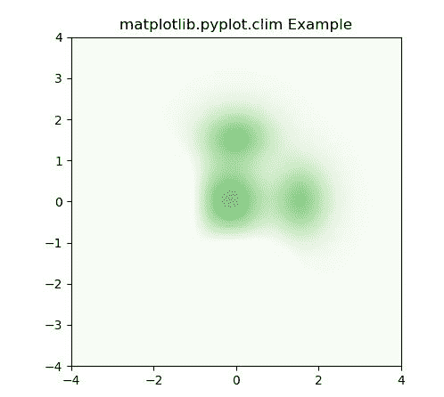
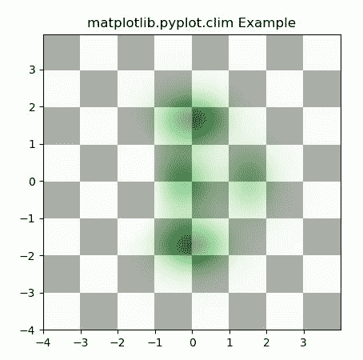

# Matplotlib.pyplot.clim()用 Python

表示

> 哎哎哎:# t0]https://www . geeksforgeeks . org/matplot lib-pyplot-clim-in-python/

**[Matplotlib](https://www.geeksforgeeks.org/python-introduction-matplotlib/)** 是 Python 中的一个库，是 NumPy 库的数值-数学扩展。 **[Pyplot](https://www.geeksforgeeks.org/pyplot-in-matplotlib/)** 是一个基于状态的接口到 **Matplotlib** 模块，它提供了一个类似于 MATLAB 的接口。Pyplot 中可以使用的各种图有线图、等高线图、直方图、散点图、三维图等。

## Matplotlib.pyplot.clim()函数

matplotlib 库 pyplot 模块中的 **clim()函数**用于设置当前图像的颜色限制。

> **语法:**matplotlib . pyplot . clim(vmin = none，vmax=None)
> 
> **参数:**该方法只接受两个参数。
> 
> *   **vmin，vmax :** 这些参数用于颜色缩放。

下面的例子说明了 matplotlib.pyplot.clim()函数在 matplotlib.pyplot 中的作用:

**例 1:**

```
# Implementation of matplotlib function
import matplotlib.pyplot as plt
import numpy as np
from matplotlib.colors import LogNorm

dx, dy = 0.015, 0.05
y, x = np.mgrid[slice(-4, 4 + dy, dy),
                slice(-4, 4 + dx, dx)]

z = (1 - x / 3\. + x ** 5 + y ** 5) * np.exp(-x ** 2 - y ** 2)
z = z[:-1, :-1]
z_min, z_max = -np.abs(z).max(), np.abs(z).max()

im = plt.imshow(z, cmap ='Greens', 
                vmin = z_min, 
                vmax = z_max,
                extent = [x.min(),
                          x.max(), 
                          y.min(), 
                          y.max()],
                interpolation ='nearest',
                origin ='lower')

plt.clim(vmin = 0, vmax = 2)
plt.title('matplotlib.pyplot.clim Example')
plt.show()
```

**输出:**


**例 2:**

```
# Implementation of matplotlib function
import matplotlib.pyplot as plt
import numpy as np
from matplotlib.colors import LogNorm

dx, dy = 0.015, 0.05
x = np.arange(-4.0, 4.0, dx)
y = np.arange(-4.0, 4.0, dy)
X, Y = np.meshgrid(x, y)

extent = np.min(x), np.max(x), np.min(y), np.max(y)

Z1 = np.add.outer(range(8), range(8)) % 2
plt.imshow(Z1, 
           cmap ="binary_r",
           interpolation ='nearest',
           extent = extent, alpha = 1)

def geeks(x, y):
    return (1 - x / 2 + x**5 + y**6) * np.exp(-(x**2 + y**2))

Z2 = geeks(X, Y)

plt.imshow(Z2, cmap ="Greens", 
           alpha = 0.7,
           interpolation ='bilinear',
           extent = extent)

plt.clim(0, 2)
plt.title('matplotlib.pyplot.clim Example')
plt.show()
```

**输出:**
