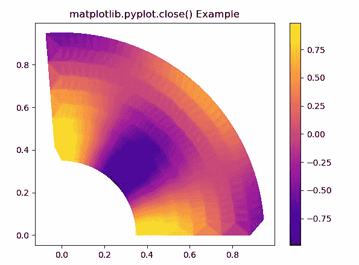

# Python 中的 Matplotlib.pyplot.close()

> 原文:[https://www . geeksforgeeks . org/matplotlib-pyplot-close-in-python/](https://www.geeksforgeeks.org/matplotlib-pyplot-close-in-python/)

**[Matplotlib](https://www.geeksforgeeks.org/python-introduction-matplotlib/)** 是 Python 中的一个库，是 NumPy 库的数值-数学扩展。 **[Pyplot](https://www.geeksforgeeks.org/pyplot-in-matplotlib/)** 是一个基于状态的接口到 **Matplotlib** 模块，它提供了一个类似于 MATLAB 的接口。Pyplot 中可以使用的各种图有线图、等高线图、直方图、散点图、三维图等。

## matplotlib.pyplot.close()函数

matplotlib 库 pyplot 模块中的**关闭()功能**用于关闭图形窗口。

> **语法:** matplotlib.pyplot.close(图=无)
> 
> **参数:**该方法只接受一个参数。
> **图:**该参数接受以下值:
> 
> 1.  **无:**该值将关闭当前数字
> 2.  **图形:**该值将关闭给定的图形实例
> 3.  **int:** 该值将关闭一个数字
> 4.  **字符串:**该值将关闭图形名称
> 5.  **“全部”:**该值将关闭所有图形
> 
> **返回:**该方法不返回任何值。

下面的例子说明了 matplotlib.pyplot.close()函数在 matplotlib.pyplot 中的作用:

**例 1:**

```py
# Implementation of matplotlib function
import matplotlib.pyplot as plt
import numpy as np
from matplotlib.colors import LogNorm

dx, dy = 0.015, 0.05
x = np.arange(-4.0, 4.0, dx)
y = np.arange(-4.0, 4.0, dy)
X, Y = np.meshgrid(x, y)

extent = np.min(x), np.max(x), np.min(y), np.max(y)

Z1 = np.add.outer(range(8), range(8)) % 2
plt.imshow(Z1, cmap ="binary_r", 
           interpolation ='nearest',
           extent = extent, 
           alpha = 1)

def geeks(x, y):
    return (1 - x / 2 + x**5 + y**6) * np.exp(-(x**2 + y**2))

Z2 = geeks(X, Y)

x = plt.imshow(Z2, cmap ="Greens", 
               alpha = 0.7, 
               interpolation ='bilinear',
               extent = extent)
plt.close()
plt.title('matplotlib.pyplot.close Example')
plt.show()
```

**输出:**


**例 2:**

```py
# Implementation of matplotlib function
import matplotlib.pyplot as plt
import numpy as np
from matplotlib.colors import LogNorm
import matplotlib.tri as tri

dx, dy = 0.015, 0.05
x = np.arange(-4.0, 4.0, dx)
y = np.arange(-4.0, 4.0, dy)
X, Y = np.meshgrid(x, y)

extent = np.min(x), np.max(x), np.min(y), np.max(y)

Z1 = np.add.outer(range(8), range(8)) % 2
plt.imshow(Z1, cmap ="binary_r", 
           interpolation ='nearest',
           extent = extent,
           alpha = 1)

def geeks(x, y):
    return (1 - x / 2 + x**5 + y**6) * np.exp(-(x**2 + y**2))

Z2 = geeks(X, Y)

x = plt.imshow(Z2, cmap ="Greens",
               alpha = 0.7, 
               interpolation ='bilinear',
               extent = extent)
plt.close(1)
ang = 40
rad = 10
radm = 0.35
radii = np.linspace(radm, 0.95, rad)

angles = np.linspace(0, 0.5 * np.pi, ang)
angles = np.repeat(angles[...,
                          np.newaxis], 
                   rad, axis = 1)

angles[:, 1::2] += np.pi / ang

x = (radii * np.cos(angles)).flatten()
y = (radii * np.sin(angles)).flatten()
z = (np.sin(4 * radii) * np.cos(4 * angles)).flatten()

triang = tri.Triangulation(x, y)
triang.set_mask(np.hypot(x[triang.triangles].mean(axis = 1),
                         y[triang.triangles].mean(axis = 1))
                < radm)

tpc = plt.tripcolor(triang, z,
                    shading ='flat')

plt.colorbar(tpc)
plt.plasma()

plt.title('matplotlib.pyplot.close() Example')
plt.show()
```

**输出:**
