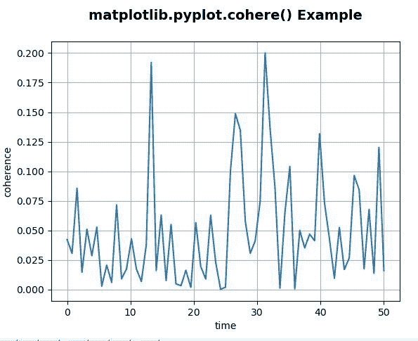
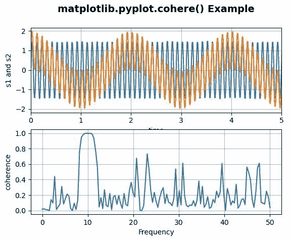

# Python 中的 matplotlib.pyplot.cohere()

> 原文:[https://www . geeksforgeeks . org/matplotlib-pyplot-cohere-in-python/](https://www.geeksforgeeks.org/matplotlib-pyplot-cohere-in-python/)

**[Matplotlib](https://www.geeksforgeeks.org/python-introduction-matplotlib/)** 是 Python 中的一个库，是 NumPy 库的数值-数学扩展。 **[Pyplot](https://www.geeksforgeeks.org/pyplot-in-matplotlib/)** 是一个基于状态的接口到 **Matplotlib** 模块，它提供了一个类似于 MATLAB 的接口。Pyplot 中可以使用的各种图有线图、等高线图、直方图、散点图、三维图等。

## matplotlib.pyplot.cohere()函数:

matplotlib 库 pyplot 模块中的**coherer()函数**用于绘制 x 和 y 之间的相干性，相干性是归一化的交叉谱密度。
T3】

> **语法:** matplotlib.pyplot.cohere(x，y，NFFT=256，Fs=2，Fc=0，detrend=，window=，noverlap=0，pad_to=None，sides='default '，scale_by_freq=None，* data = None，**kwargs)
> 
> **参数:**该方法接受以下描述的参数:
> 
> *   **x，y:** 这些参数是数据的序列。
> *   **Fs :** 此参数为标量。它的默认值是 2。
> *   **窗口:**该参数以一个数据段为自变量，返回该段的窗口版本。其默认值为 *window_hanning()*
> *   **边:**此参数指定要返回光谱的哪些边。这可以有以下值:“默认值”、“单侧”和“双侧”。
> *   **pad_to :** 此参数包含数据段填充到的整数值。
> *   **Fc:** 该参数还包含偏移绘图 x 范围的整数值，以反映频率范围。其默认值为 *0*
> *   **NFFT :** 该参数包含用于快速傅立叶变换的每个块中的数据点数。
> *   **去趋势:**此参数包含在 fft 之前应用于每个分段的函数，旨在移除均值或线性趋势{ '无'，'均值'，'线性' }。
> *   **scale_by_freq :** 该参数允许对返回的频率值进行积分。
> *   **noverlap :** 此参数是块之间重叠的点数。
> *   **Fc :** 该参数为 x 的中心频率。
> 
> **返回:**这将返回以下内容:
> 
> *   **Cxy:** 返回相干向量..
> *   **频率:**返回 Cxy 中元素的频率。
> 
> 结果是 **(Cxy，freqs)**

以下示例说明 matplotlib.pyplot.figure()函数在 matplotlib . axis:
**示例#1:**

```py
# Implementation of matplotlib function
import numpy as np
import matplotlib.pyplot as plt

dt = 0.01
t = np.arange(0, 30, dt)
nse1 = np.random.randn(len(t))
nse2 = np.random.randn(len(t))

s1 = 1.5 * np.sin(2 * np.pi * 10 * t) + nse1
s2 = np.cos(np.pi * t) + nse2

plt.cohere(s1, s2**2, 128, 1./dt)
plt.xlabel('time')
plt.ylabel('coherence')
plt.title('matplotlib.pyplot.cohere() Example\n', 
               fontsize = 14, fontweight ='bold')
plt.show()
```

**输出:**


**示例-2:**

```py
# Implementation of matplotlib function
import numpy as np
import matplotlib.pyplot as plt

dt = 0.01
t = np.arange(0, 30, dt)
nse1 = np.random.randn(len(t))
nse2 = np.random.randn(len(t))
r = np.exp(-t / 0.05)

cnse1 = np.convolve(nse1, r, mode ='same')*dt
cnse2 = np.convolve(nse2, r, mode ='same')*dt

s1 = 1.5 * np.sin(2 * np.pi * 10 * t) + cnse1
s2 = np.cos(np.pi * t) + cnse2 + np.sin(2 * np.pi * 10 * t)

fig, [ax1, ax2] = plt.subplots(2, 1)
ax1.set_title('matplotlib.pyplot.cohere() Example\n', 
                    fontsize = 14, fontweight ='bold')

ax1.plot(t, s1, t, s2)
ax1.set_xlim(0, 5)
ax1.set_xlabel('time')
ax1.set_ylabel('s1 and s2')
ax1.grid(True)

ax2.cohere(s1, s2, 256, 1./dt)
ax2.set_ylabel('coherence')
plt.show()
```

**输出:**
