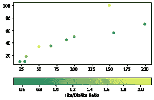
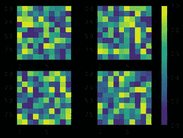
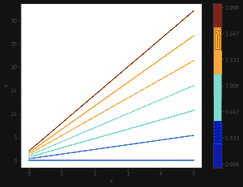

# matplotlib . pyplot . colorbar()python 中的函数

> 原文:[https://www . geeksforgeeks . org/matplotlib-pyplot-color bar-python 中的函数/](https://www.geeksforgeeks.org/matplotlib-pyplot-colorbar-function-in-python/)

颜色条是从标量值到颜色的映射的可视化。在 [Matplotlib](https://www.geeksforgeeks.org/python-introduction-matplotlib/) 中，它们被绘制成一个专用轴。

**注意:**彩条通常通过 **Figure.colorbar** 或其 [pyplot](https://www.geeksforgeeks.org/pyplot-in-matplotlib/) 包装 **pyplot.colorbar** 创建，该包装内部使用 make_axes 和 colorbar。作为最终用户，您很可能不需要调用方法或显式实例化模块中的类。

## **matplotlib.pyplot.colorbar()用 python** 表示

matplotlib 的 pyplot 模块中的 **colorbar()函数**在绘图中添加一个 colorbar，用于指示色标。

> **语法:**matplotlib . pyplot . colorbar(mappable = none，cax=None，ax=None，**kwarg)
> 
> **参数:**
> 
> **ax:** 该参数为可选参数，包含 Axes 或**Axes 列表。**
> 
> ******kwarg** (关键字参数):该参数为可选参数，有两种:**
> 
> ****彩条属性:****
> 
> ****扩展:** {“两者都不”、“都不”、“最小值”、“最大值”}为超出范围的
> 值制作尖头端。**
> 
> ****标签:**彩条长轴上的标签。**
> 
> ****刻度**:无或刻度或定位器列表。*T3】***
> 
> *****返回:** colorbar，它是类“matplotlib.colorbar.Colorbar”的一个实例。***

**以下示例说明了 matplotlib.pyplot.colorbar()函数在 matplotlib.pyplot 中的作用:**

****示例#1:** 至向散点图添加水平颜色条。**

## **蟒蛇 3**

```
# Python Program illustrating
# pyplot.colorbar() method
import numpy as np
import matplotlib.pyplot as plt

# Dataset
# List of total number of items purchased 
# from each products
purchaseCount = [100, 200, 150, 23, 30, 50,
                 156, 32, 67, 89]

# List of total likes of 10 products
likes = [50, 70, 100, 10, 10, 34, 56, 18, 35, 45]

# List of Like/Dislike ratio of 10 products
ratio = [1, 0.53, 2, 0.76, 0.5, 2.125, 0.56, 
         1.28, 1.09, 1.02]

# scatterplot
plt.scatter(x=purchaseCount, y=likes, c=ratio, cmap="summer")

plt.colorbar(label="Like/Dislike Ratio", orientation="horizontal")
plt.show()
```

****输出:****

****

****示例#2:** 向多个子场景添加单个颜色条。**

## **蟒蛇 3**

```
# Python Program illustrating
# pyplot.colorbar() method
import matplotlib.pyplot as plt

# creates four Axes
fig, axes = plt.subplots(nrows=2, ncols=2)

for ax in axes.flat:
    im = ax.imshow(np.random.random((10, 10)), vmin=0, vmax=1)

plt.colorbar(im, ax=axes.ravel().tolist())

plt.show()
```

****输出:****

****

****示例#3:** 到向不可映射的对象添加颜色条。**

## **蟒蛇 3**

```
# Python Program illustrating
# pyplot.colorbar() method
import numpy as np
import matplotlib as mpl
import matplotlib.pyplot as plt

x = np.linspace(0, 5, 100)
N = 7

# colormap
cmap = plt.get_cmap('jet', N)

fig, ax1 = plt.subplots(1, 1, figsize=(8, 6))

for i, n in enumerate(np.linspace(0, 2, N)):
    y = x*i+n
    ax1.plot(x, y, c=cmap(i))

plt.xlabel('x-axis')
plt.ylabel('y-axis')

# Normalizer
norm = mpl.colors.Normalize(vmin=0, vmax=2)

# creating ScalarMappable
sm = plt.cm.ScalarMappable(cmap=cmap, norm=norm)
sm.set_array([])

plt.colorbar(sm, ticks=np.linspace(0, 2, N))

plt.show()
```

****输出:****

****