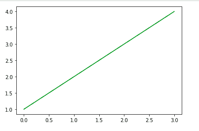
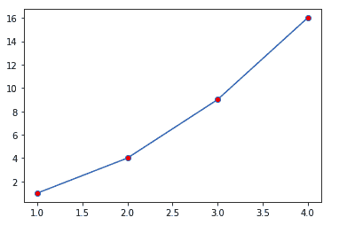

# Matplotlib.pyplot.colors()中的 Python

> 原文:[https://www . geeksforgeeks . org/matplotlib-pyplot-colors-in-python/](https://www.geeksforgeeks.org/matplotlib-pyplot-colors-in-python/)

在 Python 中，我们可以使用 **[Matplotlib](https://www.geeksforgeeks.org/python-matplotlib-an-overview/)** 库绘制可视化图形。为了将绘图集成到应用程序中，Matplotlib 提供了一个应用编程接口。Matplotlib 有一个名为 **pyplot** 的模块，提供了一个类似 MATLAB 的界面。

## Matplotlib.pyplot.colors()

该函数用于指定颜色。是**无所事事**功能。

| 别名 | 颜色 |
| --- | --- |
| ' b ' | 蓝色 |
| r′ | 红色 |
| g′ | 格林（姓氏）；绿色的 |
| c′ | 蓝绿色 |
| m′ | 品红 |
| 你好 | 黄色 |
| k′ | 黑色 |
| w ' | 怀特（姓氏） |

我们可以将此功能用于各种数据可视化，并从中获得见解。

**实施例 1:**

```py
import matplotlib.pyplot as plt

# Define the Color
color = 'green'
plt.plot([1, 2, 3, 4], color = color)

plt.show()
```

**输出:**



**例 2:**

```py
import matplotlib.pyplot as plt

x = [1, 2, 3, 4]
y= [1, 4, 9, 16]

plt.plot(x, y, marker = 'o', markerfacecolor = 'r')

plt.show()
```

**输出:**



这里，**标记='o'** 代表圆，而**标记**用于指定点标记的颜色。

**注意:**这个功能从 2.1 版本开始就被弃用了。