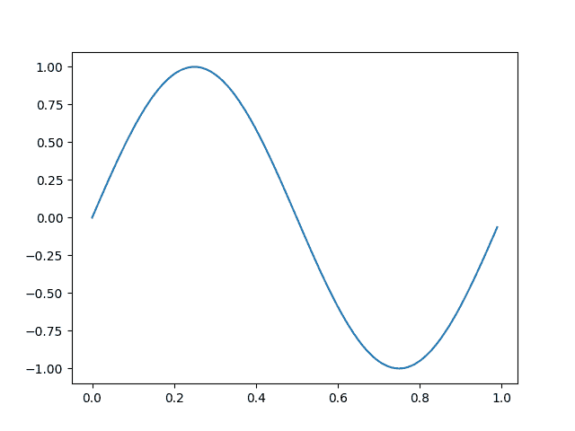
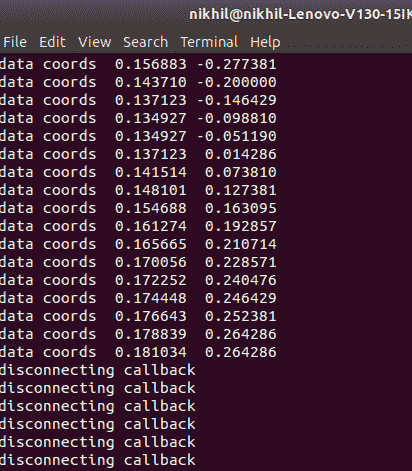
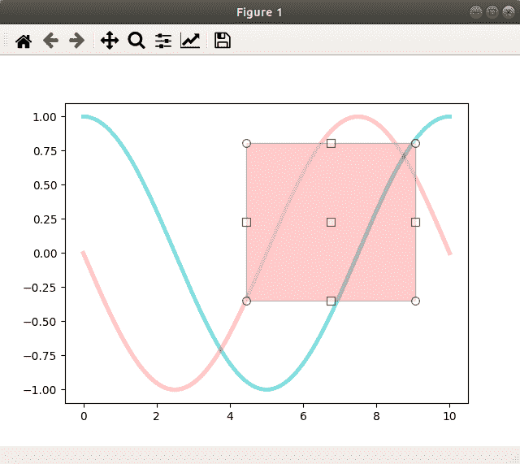
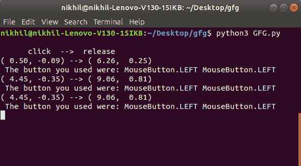

# Matplotlib.pyplot.connect()用 Python

表示

> 哎哎哎:# t0]https://www . geeksforgeeks . org/matplot lib-pyplot-in-python/连接

**[Matplotlib](https://www.geeksforgeeks.org/python-introduction-matplotlib/)** 是 Python 中的一个库，是 NumPy 库的数值-数学扩展。 **[Pyplot](https://www.geeksforgeeks.org/pyplot-in-matplotlib/)** 是一个基于状态的接口到 **Matplotlib** 模块，它提供了一个类似于 MATLAB 的接口。

## matplotlib.pyplot.connect()函数

此方法用于将字符串为 s 的事件连接到函数。

> **语法:** matplotlib.pyplot.connect(s，func)
> 
> **参数:**此方法接受以下描述的参数:
> **s(str):** 以下事件之一 id:
> 1。button_press_event'
> 2。button_release_event'
> 3。draw_event'
> 4。key_press_event'
> 5。key_release_event'
> 6。motion_notify_event'
> 7。pick_event'
> 8。resize_event'
> 9。scroll_event'
> 10。图 _enter_event '，
> 11。图 _leave_event '，
> 12。axes_enter_event '，
> 13。axes_leave_event'
> 14。“close_event”。
> **func(可调用):**要执行的回调函数，必须有签名:
> def func(Event:Event)->Any
> 
> **返回(cid):** 一个可以与 figure canvasbase . mpl _ disconnect 一起使用的连接 id。

**例 1 :**

```
# matplotlib.pyplot.connect()
from matplotlib.backend_bases import MouseButton
import matplotlib.pyplot as plt
import numpy as np

t = np.arange(0.0, 1.0, 0.01)
s = np.sin(2 * np.pi * t)
fig, ax = plt.subplots()
ax.plot(t, s)

def on_move(event):

    # get the x and y pixel coords
    x, y = event.x, event.y

    if event.inaxes:
        ax = event.inaxes  # the axes instance
        print('data coords % f % f' % (event.xdata,
                                       event.ydata))

def on_click(event):

    if event.button is MouseButton.LEFT:
        print('disconnecting callback')
        plt.disconnect(binding_id)

binding_id = plt.connect('motion_notify_event',
                         on_move)

plt.connect('button_press_event', on_click)

plt.show()
```

**输出:**





**例 2 :**

```
from matplotlib.widgets import RectangleSelector
import numpy as np
import matplotlib.pyplot as plt

def line_select_callback(eclick, erelease):

    # Callback for line selection.
    # *eclick * and * erelease *
    # are the press and release events.
    x1, y1 = eclick.xdata, eclick.ydata
    x2, y2 = erelease.xdata, erelease.ydata
    print("(% 3.2f, % 3.2f) --> (% 3.2f, % 3.2f)" % (x1, y1, x2, y2))
    print(" The button you used were: % s % s" % (eclick.button, 
                                                  erelease.button))

def toggle_selector(event):

    print(' Key pressed.')

    if event.key in ['Q', 'q'] and toggle_selector.RS.active:
        print(' RectangleSelector deactivated.')
        toggle_selector.RS.set_active(False)
        print(' RectangleSelector activated.')
        toggle_selector.RS.set_active(True)

# make a new plotting range
fig, current_ax = plt.subplots()

# If N is large one can see
N = 100000

# improvement by use blitting ! 
# plt.plot(x, +np.sin(.2 * np.pi * x), 
# lw = 3.5, c ='b', alpha =.7)  
# plot something
x = np.linspace(0.0, 10.0, N)
plt.plot(x, +np.cos(.2 * np.pi * x), 
         lw = 3.5, c ='c', alpha =.5)
plt.plot(x, -np.sin(.2 * np.pi * x), 
         lw = 3.5, c ='r', alpha =.3)

print("\n      click  -->  release")

# drawtype is 'box' or 'line' or 'none'
toggle_selector.RS = RectangleSelector(current_ax, line_select_callback,
                                       drawtype ='box',
                                       useblit = True,
                                       button =[1, 3],  # don't use middle button
                                       minspanx = 5, minspany = 5,
                                       spancoords ='pixels',
                                       interactive = True)

plt.connect('key_press_event', toggle_selector)
plt.show()
```

**输出:**



