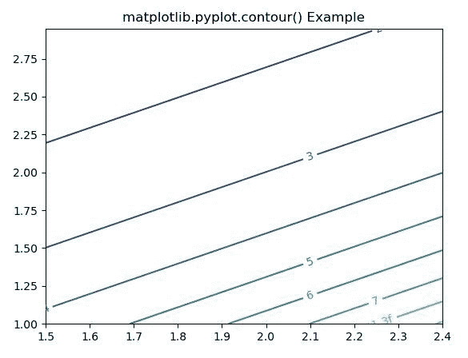
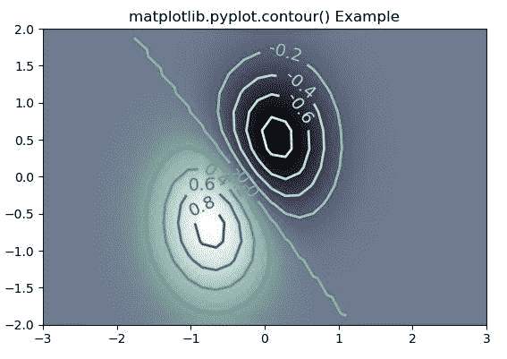

# Matplotlib.pyplot.contour()用 Python

表示

> 哎哎哎:# t0]https://www . geeksforgeeks . org/matplot lib-pyplot-contour-in python/

**[Matplotlib](https://www.geeksforgeeks.org/python-introduction-matplotlib/)** 是 Python 中的一个库，是 NumPy 库的数值-数学扩展。 **[Pyplot](https://www.geeksforgeeks.org/pyplot-in-matplotlib/)** 是一个基于状态的接口到 **Matplotlib** 模块，它提供了一个类似于 MATLAB 的接口。

## matplotlib.pyplot.contour()函数

matplotlib 库 pyplot 模块中的**等高线()函数**用于绘制等高线。

> **语法:**matplotlib . pyplot . contour(\ * args，data=None，\*\*kwargs)
> 
> **参数:**该方法接受以下描述的参数:
> 
> *   **X，Y:** 这些参数是 z 中数值的坐标
> *   **Z :** 该参数是绘制轮廓的高度值。
> *   **级别:**此参数用于确定轮廓线/区域的数量和位置。
> 
> **返回:**这将返回以下内容:
> 
> *   **c :** 这返回`QuadContourSet`。

下面的例子说明了 matplotlib.pyplot.contour()函数在 matplotlib.pyplot 中的作用:

**示例#1:**

```py
# Implementation of matplotlib function
import numpy as np
import matplotlib.pyplot as plt
import matplotlib.ticker as ticker
import matplotlib

delta = 0.15
x = np.arange(1.5, 2.5, delta)
y = np.arange(1.0, 3.0, delta)
X, Y = np.meshgrid(x, y)
Z = (np.exp(X - Y))

CS1 = plt.contour(X, Y, Z)

fmt = {}
strs = ['1', '2', '3', '4', '5', '6', '7']
for l, s in zip(CS1.levels, strs):
    fmt[l] = s
plt.clabel(CS1, CS1.levels, inline = True,
           fmt = fmt, fontsize = 10)

plt.title('matplotlib.pyplot.contour() Example')
plt.show()
```

**输出:**


**例 2:**

```py
# Implementation of matplotlib function
import matplotlib
import numpy as np
import matplotlib.cm as cm
import matplotlib.pyplot as plt

delta = 0.25
x = np.arange(-3.0, 5.0, delta)
y = np.arange(-1.3, 2.5, delta)
X, Y = np.meshgrid(x, y)
Z = (np.exp(-X**2 - Y**2) - np.exp(-(X - 1)**2 - (Y - 1)**2))

fig, ax = plt.subplots()
im = ax.imshow(Z, interpolation ='bilinear',
               origin ='lower',
               cmap ="bone", 
               extent =(-3, 3, -2, 2))

levels = np.arange(-1.2, 1.6, 0.2)
CS = ax.contour(Z, levels, 
                origin ='lower',
                cmap ='Greens',
                linewidths = 2,
                extent =(-3, 3, -2, 2))

zc = CS.collections[6]
plt.setp(zc, linewidth = 2)

ax.clabel(CS, levels,
          inline = 1, 
          fmt ='% 1.1f',
          fontsize = 14)

plt.title('matplotlib.pyplot.contour() Example')
plt.show()
```

**输出:**
