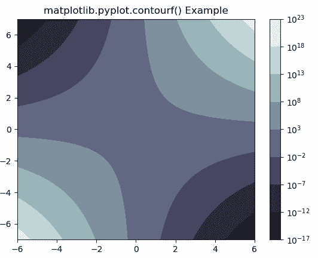
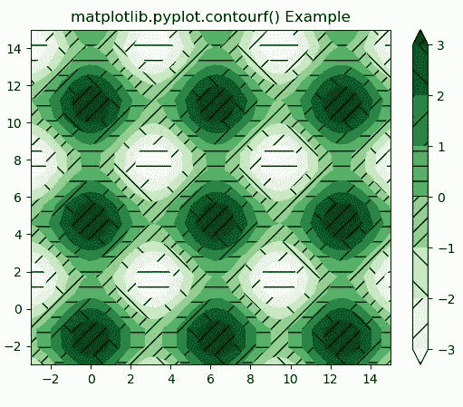

# Matplotlib.pyplot.contourf()用 Python

表示

> 哎哎哎:# t0]https://www . geeksforgeeks . org/matplot lib-pyplot-contourf-in-python/

**[Matplotlib](https://www.geeksforgeeks.org/python-introduction-matplotlib/)** 是 Python 中的一个库，是 NumPy 库的数值-数学扩展。 **[Pyplot](https://www.geeksforgeeks.org/pyplot-in-matplotlib/)** 是一个基于状态的接口到 **Matplotlib** 模块，它提供了一个类似于 MATLAB 的接口。

## matplotlib . pyplot . contourf()函数

matplotlib 库 pyplot 模块中的 **contourf()函数**用于绘制等高线。但是 contourf 绘制填充轮廓，而 contourf 绘制轮廓线。

> **语法:**matplotlib . pyplot . contour(\ * args，data=None，\*\*kwargs)
> 
> **参数:**该方法接受以下描述的参数:
> 
> *   **X，Y:** 这些参数是 z 中数值的坐标
> *   **Z :** 该参数是绘制轮廓的高度值。
> *   **级别:**此参数用于确定轮廓线/区域的数量和位置。
> 
> **返回:**这将返回以下内容:
> 
> *   **c :** 这返回`QuadContourSet`。

以下示例说明了 matplotlib.pyplot.contourf()函数在 matplotlib.pyplot 中的作用:

**示例#1:**

```
# Implementation of matplotlib function
import numpy as np
import matplotlib.pyplot as plt
from numpy import ma
from matplotlib import ticker, cm

N = 1000
x = np.linspace(-6.0, 6.0, N)
y = np.linspace(-7.0, 7.0, N)
X, Y = np.meshgrid(x, y)

Z1 = np.exp(X * Y)
z = 50 * Z1
z[:5, :5] = -1
z = ma.masked_where(z <= 0, z)

cs = plt.contourf(X, Y, z,
                  locator = ticker.LogLocator(),
                  cmap ="bone")

cbar = plt.colorbar(cs)

plt.title('matplotlib.pyplot.contourf() Example')
plt.show()
```

**输出:**


**例 2:**

```
# Implementation of matplotlib function
import matplotlib.pyplot as plt
import numpy as np

# invent some numbers, turning 
# the x and y arrays into simple
# 2d arrays, which make combining 
# them together easier.
x = np.linspace(-3, 15, 50).reshape(1, -1)
y = np.linspace(-3, 15, 20).reshape(-1, 1)
z = np.cos(x)*2 - np.sin(y)*2

# we no longer need x and y to
# be 2 dimensional, so flatten them.
x, y = x.flatten(), y.flatten()

cs = plt.contourf(x, y, z, 
                  hatches =['-', '/',
                            '\\', '//'],
                  cmap ='Greens',
                  extend ='both',
                  alpha = 1)

plt.colorbar(cs)

plt.title('matplotlib.pyplot.contourf() Example')
plt.show()
```

**输出:**
