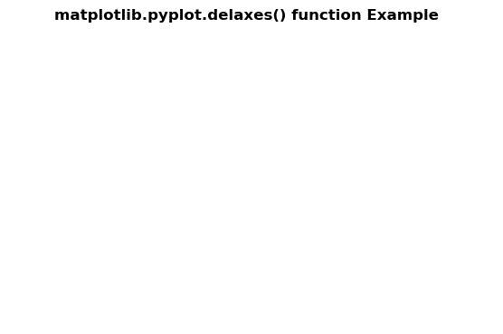
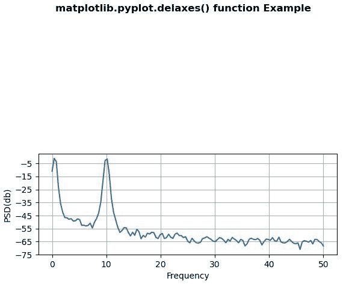

# Matplotlib.pyplot.delaxes()用 Python

表示

> 哎哎哎:# t0]https://www . geeksforgeeks . org/matplot lib-pyplot-delaxes-in-python/

**[Matplotlib](https://www.geeksforgeeks.org/python-introduction-matplotlib/)** 是 Python 中的一个库，是 NumPy 库的数值-数学扩展。 **[Pyplot](https://www.geeksforgeeks.org/pyplot-in-matplotlib/)** 是一个基于状态的接口到 **Matplotlib** 模块，它提供了一个类似于 MATLAB 的接口。

## matplotlib.pyplot.delaxes()函数

matplotlib 库 pyplot 模块中的 **delaxes()函数**用于从其图形中移除 Axes ax。

> **语法:**matplotlib . pyplot . delaxes(ax = none)
> 
> **参数:**该方法接受以下描述的参数:
> 
> *   **ax:** 此参数是要移除的轴。其默认值为“无”。

下面的例子说明了 matplotlib.pyplot.delaxes()函数在 matplotlib.pyplot 中的作用:

**示例#1:**

```
# Implementation of matplotlib function
import matplotlib.pyplot as plt
import numpy as np

# make an agg figure
fig, ax = plt.subplots()
ax.plot([1, 2, 3])

plt.delaxes()

plt.suptitle('matplotlib.pyplot.delaxes() function Example',
              fontweight ="bold")

plt.show()
```

**输出:**


**例 2:**

```
# Implementation of matplotlib function
import numpy as np
import matplotlib.pyplot as plt

dt = 0.01
t = np.arange(0, 30, dt)
nse1 = np.random.randn(len(t))
r = np.exp(-t / 0.05)

cnse1 = np.convolve(nse1, r, mode ='same')*dt

s1 = np.cos(np.pi * t) + cnse1 + np.sin(2 * np.pi * 10 * t) 

fig, [ax1, ax2] = plt.subplots(2, 1)
ax1.plot(t, s1)
ax1.set_xlim(0, 5)
ax1.set_ylabel('value s1')
ax1.grid(True)

ax2.psd(s1, 256, 1./dt)
ax2.set_ylabel('PSD(db)')
ax2.set_xlabel('Frequency')

plt.delaxes(ax = ax1)

plt.suptitle('matplotlib.pyplot.delaxes() function Example',
              fontweight ="bold")

plt.show()
```

**输出:**
