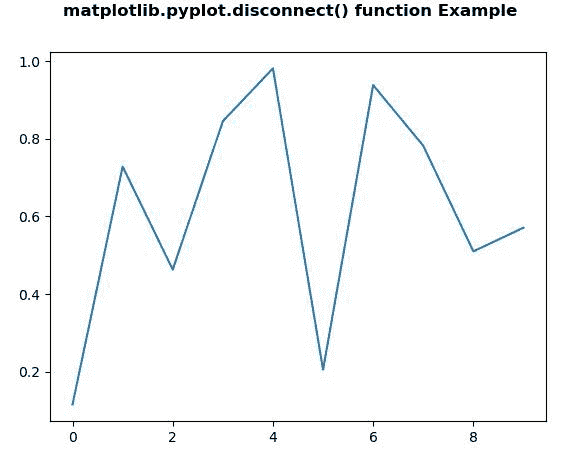
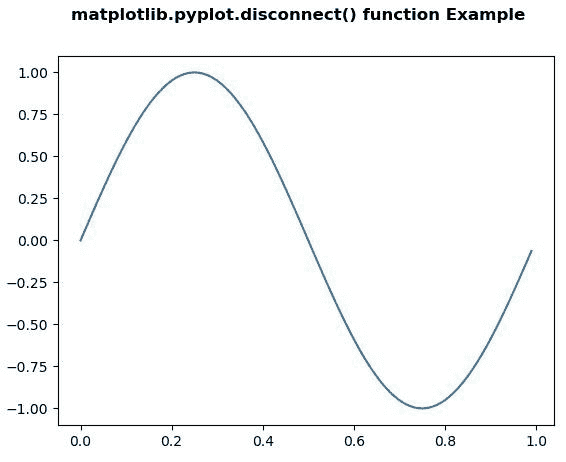
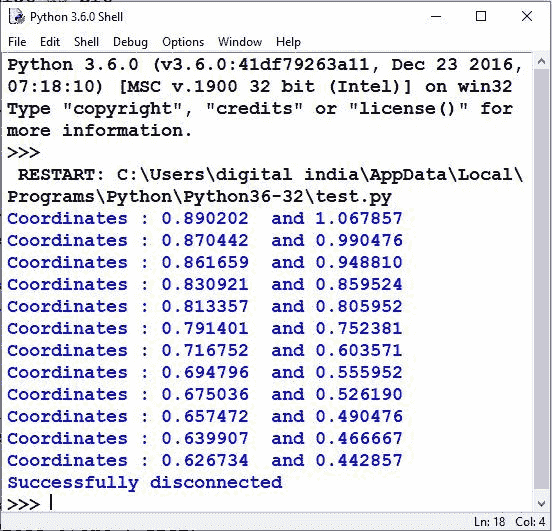

# Python 中的 Matplotlib.pyplot.disconnect()

> 原文:[https://www . geeksforgeeks . org/matplotlib-pyplot-断开 python 中的连接/](https://www.geeksforgeeks.org/matplotlib-pyplot-disconnect-in-python/)

**[Matplotlib](https://www.geeksforgeeks.org/python-introduction-matplotlib/)** 是 Python 中的一个库，是 NumPy 库的数值-数学扩展。 **[Pyplot](https://www.geeksforgeeks.org/pyplot-in-matplotlib/)** 是一个基于状态的接口到 **Matplotlib** 模块，它提供了一个类似于 MATLAB 的接口。

## matplotlib.pyplot.disconnect()函数

matplotlib 库 pyplot 模块中的 **disconnect()函数**用于断开 id 为 cid 的回调。

> **语法:**matplotlib . pyplot . disconnect(cid)
> 
> **参数:**该方法接受以下描述的参数:
> 
> *   **cid:** 此参数用于断开回拨。

下面的例子说明了 matplotlib.pyplot.disconnect()函数在 matplotlib.pyplot 中的作用:

**示例#1:**

```
# Implementation of matplotlib function
import numpy as np
import matplotlib.pyplot as plt

fig, ax = plt.subplots()
ax.plot(np.random.rand(10))

def onclick(event):
    print('% s click: button =% d, x =% d, y =% d,\
    xdata =% f, ydata =% f' %
          ('double' if event.dblclick else 'single',
           event.button,
           event.x,
           event.y, 
           event.xdata, 
           event.ydata))

cid = fig.canvas.mpl_connect('button_press_event',
                             onclick)
fig.canvas.mpl_disconnect(cid)

plt.suptitle('matplotlib.pyplot.disconnect()\
function Example', fontweight ="bold")

plt.show()
```

**输出:**


**例 2:**

```
# Implementation of matplotlib function
from matplotlib.backend_bases import MouseButton
import matplotlib.pyplot as plt
import numpy as np

t = np.arange(0.0, 1.0, 0.01)
s = np.sin(2 * np.pi * t)
fig, ax = plt.subplots()
ax.plot(t, s)

def gfg1(event):

    # get the x and y pixel coords
    x, y = event.x, event.y
    if event.inaxes:

        # the axes instance
        ax = event.inaxes
        print('Coordinates : % f  and\
        % f' % (event.xdata, event.ydata))

def gfg2(event):

    if event.button is MouseButton.LEFT:
        print('Successfully disconnected')
        plt.disconnect(binding_id)

binding_id = plt.connect('motion_notify_event',
                         gfg1)

plt.connect('button_press_event', gfg2)

plt.suptitle('matplotlib.pyplot.disconnect()\
function Example', fontweight ="bold")
plt.show()
```

**输出:**
**如图所示**


**背景结果点击图**
后