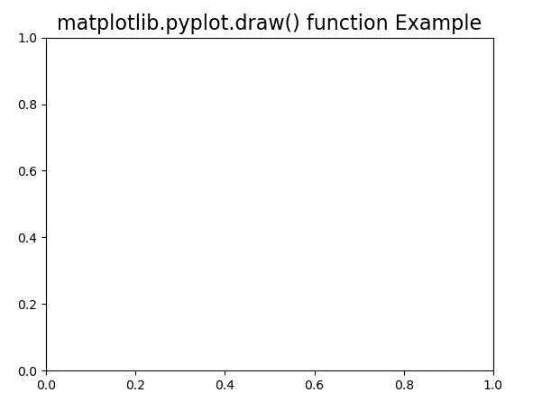
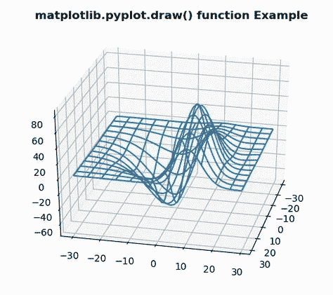

# Matplotlib.pyplot.draw()用 Python

表示

> 原文:[https://www . geeksforgeeks . org/matplotlib-pyplot-draw-in-python/](https://www.geeksforgeeks.org/matplotlib-pyplot-draw-in-python/)

**[Matplotlib](https://www.geeksforgeeks.org/python-introduction-matplotlib/)** 是 Python 中的一个库，是 NumPy 库的数值-数学扩展。 **[Pyplot](https://www.geeksforgeeks.org/pyplot-in-matplotlib/)** 是一个基于状态的接口到 **Matplotlib** 模块，它提供了一个类似于 MATLAB 的接口。

## matplotlib.pyplot.draw()函数

matplotlib 库 pyplot 模块中的 **draw()函数**用于重绘当前图形。

> **语法：** matplotlib.pyplot.over（）

下面的例子说明了 matplotlib.pyplot.draw()函数在 matplotlib.pyplot 中的作用:

**示例#1:**

```
# Implementation of matplotlib function
import numpy as np
import matplotlib.pyplot as plt

def tellme(s):
    plt.title(s, fontsize = 16)
    plt.draw()
plt.clf()
plt.setp(plt.gca(), autoscale_on = False)

tellme('matplotlib.pyplot.draw() function Example')
plt.show()
```

**输出:**


**例 2:**

```
# Implementation of matplotlib function
from mpl_toolkits.mplot3d import axes3d
import matplotlib.pyplot as plt

fig = plt.figure()
ax = fig.add_subplot(111, projection ='3d')

X, Y, Z = axes3d.get_test_data(0.1)
ax.plot_wireframe(X, Y, Z, rstride = 5, 
                  cstride = 5)

for angle in range(0, 360):
    ax.view_init(30, angle)
    plt.draw()
    plt.pause(.001)
    ax.set_title('matplotlib.pyplot.draw()\
    function Example', fontweight ="bold")
```

**输出:**
