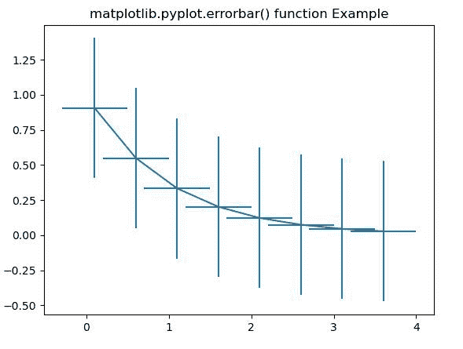
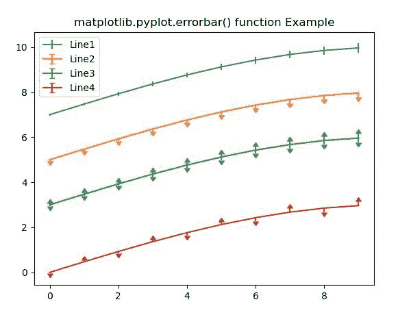

# Matplotlib.pyplot.errorbar()用 Python

表示

> 哎哎哎:# t0]https://www . geeksforgeeks . org/matplot lib-pyplot-error bar-in-python/

**[Matplotlib](https://www.geeksforgeeks.org/python-introduction-matplotlib/)** 是 Python 中的一个库，是 NumPy 库的数值-数学扩展。 **[Pyplot](https://www.geeksforgeeks.org/pyplot-in-matplotlib/)** 是一个基于状态的接口到 **Matplotlib** 模块，它提供了一个类似于 MATLAB 的接口。

## matplotlib.pyplot.errorbar()函数:

matplotlib 库 pyplot 模块中的 **errorbar()函数**用于将 y 对 x 绘制为带有附加 errorbar 的线条和/或标记。

> **语法:**matplotlib . pyplot . error bar(x，y，yerr=None，xerr=None，fmt= "，ecolor=None，elinewidth =None，倾覆= None，barsabove = False，lolims=False，uplims=False，xlolims=False，xuplims=False，errorevery=1，capthick=None，*，data=None，*\*kwargs)
> 
> **参数:**该方法接受以下描述的参数:
> 
> *   **x，y:** 这些参数是数据点的水平和垂直坐标。
> *   **fmt:** 该参数为可选参数，包含字符串值。
> *   **xerr，yerr:** 这些参数包含一个数组。并且错误数组应该有正值。
> *   **ecolor:** 该参数为可选参数。它是误差线的颜色，默认值为*无*。
> *   **elinewidth:** 该参数也是可选参数。默认值为误差线的线宽*无*。
> *   **倾覆:**该参数也是可选参数。它是以点为单位的误差线长度，默认值为*无*。
> *   **barsabove:** 该参数也是可选参数。它包含布尔值“真”，用于在绘图符号上方绘制误差线。其默认值为“假”。
> *   **lolims、uplims、xlolims、xuplims:** 这些参数也是可选参数。它们包含布尔值，用于指示一个值只给出上限/下限。
> *   **错误每:**该参数也是可选参数。它们包含用于在数据子集上绘制误差线的整数值。
> 
> **返回:**返回容器，包括以下内容:
> 
> *   **绘图线:**这将返回 x，y 绘图标记和/或线的线 2D 实例。
> *   **caplines:** 这将返回误差线 caps 的 Line2D 实例的元组。
> *   **barlinecols:** 这将返回 LineCollection 的元组，包含水平和垂直误差范围。

下面的例子说明了 matplotlib.pyplot.errorbar()函数在 matplotlib.pyplot 中的作用:

**示例#1:**

```
# Implementation of matplotlib function
import numpy as np
import matplotlib.pyplot as plt

# example data
xval = np.arange(0.1, 4, 0.5)
yval = np.exp(-xval)

plt.errorbar(xval, yval, xerr = 0.4, yerr = 0.5)

plt.title('matplotlib.pyplot.errorbar() function Example')
plt.show()
```

**输出:**


**例 2:**

```
# Implementation of matplotlib function
import numpy as np
import matplotlib.pyplot as plt

fig = plt.figure()
x = np.arange(10)
y = 3 * np.sin(x / 20 * np.pi)
yerr = np.linspace(0.05, 0.2, 10)

plt.errorbar(x, y + 7, yerr = yerr,
             label ='Line1')
plt.errorbar(x, y + 5, yerr = yerr,
             uplims = True, 
             label ='Line2')
plt.errorbar(x, y + 3, yerr = yerr, 
             uplims = True, 
             lolims = True,
             label ='Line3')

upperlimits = [True, False] * 5
lowerlimits = [False, True] * 5
plt.errorbar(x, y, yerr = yerr,
             uplims = upperlimits, 
             lolims = lowerlimits,
             label ='Line4')

plt.legend(loc ='upper left')

plt.title('matplotlib.pyplot.errorbar()\
function Example')
plt.show()
```

**输出:**
