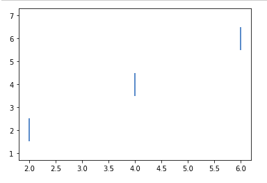
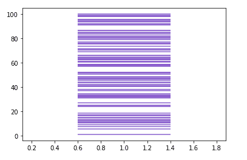

# Matplotlib.pyplot.eventplot()用 Python

表示

> 哎哎哎:# t0]https://www . geeksforgeeks . org/matplot lib-pyplot-event plot-in-python/

[**Matplotlib**](http://geeksforgeeks.org/python-matplotlib-an-overview/) 是 Python 中一个惊人的可视化库，用于数组的 2D 图。Matplotlib 是一个多平台数据可视化库，构建在 NumPy 数组上，旨在与更广泛的 SciPy 堆栈一起工作。

## Matplotlib.pyplot.eventplot()

该函数通常用于在给定位置绘制相同的线。一般来说，这些图用于表示神经科学中的神经事件，通常称为尖峰光栅或点光栅或光栅图。更常见的是，它还用于显示多组不同或离散事件的定时或定位。例如，员工每月每天到达企业的时间，或者过去十年或百年中每年飓风的日期。

> **语法::** matplotlib.pyplot.eventplot(位置，方向= '垂直'，行偏移量=2，行长度=2，行宽度=无，颜色=无，行样式= '实心'，*，数据=无，**kwargs)
> 
> **参数:**
> 
> *   **位置:**该参数通常是一个类似 1D 或 D 数组的对象，数组中的每个值代表一个事件。对于类似 2D 阵列的位置，每行对应于行或列，这取决于方向参数。这是此方法的必需参数。
> *   **方向:**这是一个可选参数，取两个值“水平”或“垂直”。它负责控制事件集合的方向。如果传递的方向值为“水平”,则行水平排列并垂直，而如果传递的值为“垂直”,则行垂直排列并水平
> *   **line offset:**这是一个可选参数，默认值为 1。此参数用于绘制从原点开始的直线中心的偏移，这些直线与地块的方向正交。它接受标量或标量序列作为其值。
> *   **行长度:**与 lineoffsets 类似，它也是一个可选参数，默认值为 1，接受标量或标量序列作为其值。它用于设置线条的总高度。它将线条的长度从 line offset–line length/2 设置为 lineoffset + linelength/2。
> *   **线宽:**为可选参数，默认值为无。它接受标量或标量序列或无作为值。它用于以点为单位设置事件线的线宽。如果设置为无，则默认为其 rcParams 设置。
> *   **颜色:**顾名思义，用于设置事件线的颜色。它是一个可选参数，默认值为无。如果该值为无，则默认为其 rcParams 设置。它将颜色、颜色序列或无作为一个值。
> *   **linestyle:**它是一个可选参数，以字符串、元组或字符串或元组序列作为其值。此参数的默认值为“固态”。此参数的有效字符串为['实线'，'虚线'，' dashdot '，'虚线'，'-'，'-'。, ':'].破折号元组需要采用(offset，onoffseq)的形式，其中 onoffseq 是偶数长度点的开和关油墨元组。
> *   ****kwargs:** 为可选参数。它通常接受 LineCollection 属性中的关键字。
> 
> **返回:**
> 这个方法返回一个包含添加的事件集合的事件集合对象列表。

**注意:**需要注意的是，对于行长度、行宽度、颜色和行样式，如果只提供一个值，则这些值将应用于所有行，而对于类似数组的值，重要的是它与位置具有相同的长度，并且每个值都应用于数组的相应行。

**例 1:**

```
import numpy as np
import matplotlib.pyplot as plt

positions = np.array([2, 4, 6])[:,np.newaxis]
offsets = [2,4,6]

plt.eventplot(positions, lineoffsets=offsets)
plt.show()
```

**输出:**



**例 2:**

```
import numpy as np
import matplotlib.pyplot as plt

spike = 100*np.random.random(100)
plt.eventplot(spike, 
              orientation = 'vertical',
              linelengths = 0.8, 
              color = [(0.5,0.5,0.8)])
```

**输出:**

