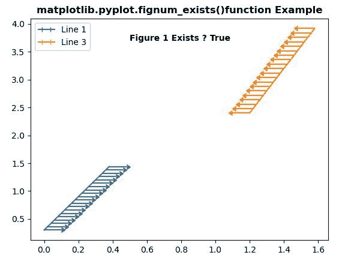
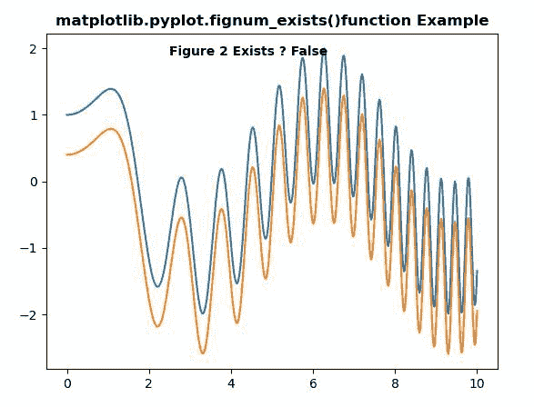

# Python 中 matplotlib . pyplot . fignum _ exists()

> 原文:[https://www . geeksforgeeks . org/matplotlib-pyplot-fig num _ exists-in-python/](https://www.geeksforgeeks.org/matplotlib-pyplot-fignum_exists-in-python/)

**[Matplotlib](https://www.geeksforgeeks.org/python-introduction-matplotlib/)** 是 Python 中的一个库，是 NumPy 库的数值-数学扩展。 **[Pyplot](https://www.geeksforgeeks.org/pyplot-in-matplotlib/)** 是一个基于状态的 Matplotlib 模块接口，它提供了一个类似 MATLAB 的接口。Pyplot 中可以使用的各种图有线图、等高线图、直方图、散点图、三维图等。

## matplotlib . pyplot . fig num _ exists()方法

matplotlib 库 pyplot 模块中的 **fignum_exists()方法**用于获取给定 id 的图形是否存在。

> **语法:**matplotlib . pyplot . fig num _ exists(num)
> 
> **参数:**
> **num:** 此参数为图号。
> 
> **返回:**该方法返回给定 id 的图形是否存在。

下面的例子说明了 matplotlib.pyplot . fig num _ exists()函数在 matplotlib . py plot 中的作用:

**例 1:**

```
#Implementation of matplotlib function
import matplotlib.pyplot as plt
import numpy as np

x = np.arange(20) / 50
y = (x + 0.1)*3

val1 = [True, False] * 10
val2 = [False, True] * 10

plt.errorbar(x, y, 
             xerr=0.1,
             xlolims=True,
             label='Line 1')

y = (x + 0.3)*3

y = (x + 0.6)*4

plt.errorbar(x + 1.2,
             y,
             xerr=0.1,
             xuplims=True, 
             label='Line 3')

plt.legend()

plt.text(0.5, 3.7,
         "Figure 1 Exists ? " +
         str(plt.fignum_exists(1)) ,
         fontweight="bold")

plt.title('matplotlib.pyplot.fignum_exists()function\
Example' ,fontweight="bold") 

plt.show() 
```

**输出:**


**例 2:**

```
# Implementation of matplotlib function
import numpy as np
import matplotlib.pyplot as plt

x = np.linspace(0, 10, 500)
y = np.sin(x**2)+np.cos(x)

plt.plot(x, y, label ='Line 1')
plt.plot(x, y - 0.6, label ='Line 2')

plt.text(2.5, 1.9,
         "Figure 2 Exists ? " +
         str(plt.fignum_exists(2)), 
         fontweight ="bold")

plt.title('matplotlib.pyplot.fignum_exists()function\
 Example', fontweight ="bold") 

plt.show() 
```

**输出:**
