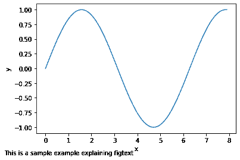
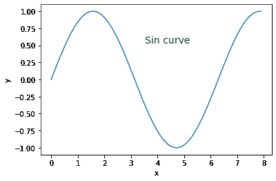
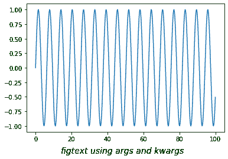

# Matplotlib.pyplot.figtext()中的 Python

> 哎哎哎:# t0]https://www . geeksforgeeks . org/matplot lib-pyplot-figtext-in-python/

[**Matplotlib**](http://geeksforgeeks.org/python-matplotlib-an-overview/) 是一个广泛用于数据可视化的 Python 库。这是一个建立在 NumPy 阵列上的多平台数据可视化库，也是为与 SciPy 堆栈一起工作而设计的。

## Matplotlib.pyplot.figtext（）

Figtext 用于在图形上的任何位置向图形添加文本。您甚至可以在轴外添加文本。它使用完整的坐标数字，其中左下角表示(0，0)，右上角表示(1，1)。图的中心是(0.5，0.5)。

**语法:**

```py
matplotlib.pyplot.figtext(x, y, s, *args, **kwargs)
```

| 参数 | 价值观念 | 使用 |
| --- | --- | --- |
| x，y | 浮动 | 放置文本的位置。默认情况下，它位于图坐标[0，1]中 |
| s | 线 | 文本字符串 |

**示例#1:** 演示 figtext 使用的示例。

```py
# importing required modules 
import matplotlib.pyplot as plt
import numpy as np

# values of x and y axes 
x = np.arange(0, 8, 0.1)
y = np.sin(x) 
plt.plot(x, y)

# pyplot.figtext(x, y, string)
plt.figtext(0, 0, "This is a sample example \
explaining figtext", fontsize = 10)

plt.xlabel('x') 
plt.ylabel('y') 
plt.show()
```


以上示例将文本放置在给定字体大小的图的左下角。

**示例#2:** 我们也可以通过调整 x 和 y 的值，将文本放置在图中的相对位置。

```py
# importing required modules 
import matplotlib.pyplot as plt
import numpy as np

# values of x and y axes 
x = np.arange(0, 8, 0.1)
y = np.sin(x) 
plt.plot(x, y)

plt.figtext(0.55, 0.7,
            "Sin curve",
            horizontalalignment ="center", 
            verticalalignment ="center", 
            wrap = True, fontsize = 14, 
            color ="green")

plt.xlabel('x') 
plt.ylabel('y') 
plt.show()
```


对齐参数-水平对齐和垂直对齐将文本放在中间，而环绕参数确保文本位于图形宽度内。颜色参数给出字体颜色。

**示例#3:** 我们还可以使用 bbox 参数在文本周围添加一个边界框。

```py
# importing required modules 
import matplotlib.pyplot as plt
import numpy as np

# values of x and y axes 
x = np.arange(0, 8, 0.1)
y = np.exp(x) 
plt.plot(x, y)

# pyplot.figtext(x, y, string)
plt.figtext(0.55, 0.7, 
            "Exponential Curve",
            horizontalalignment ="center",
            wrap = True, fontsize = 10, 
            bbox ={'facecolor':'grey', 
                   'alpha':0.3, 'pad':5})

plt.xlabel('x') 
plt.ylabel('y') 
plt.show()
```


**示例#4:** 我们还可以使用*args 和**kwargs 向我们的图中添加文本属性。*args 和**kwargs 用于向函数传递多个参数或关键字参数。
**注:**更多信息参考文章:[* Python 中的 args 和* * kwargs](https://www.geeksforgeeks.org/args-kwargs-python/)

```py
# importing required properties
import numpy as np
import matplotlib.pyplot as plt

x = np.linspace(0, 100, 501)
y = np.sin(x)

figtext_args = (0.5, 0,
                "figtext using args and kwargs")

figtext_kwargs = dict(horizontalalignment ="center", 
                      fontsize = 14, color ="green", 
                      style ="italic", wrap = True)

plt.plot(x, y) 
plt.figtext(*figtext_args, **figtext_kwargs)
plt.show()
```

