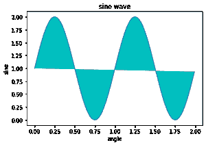
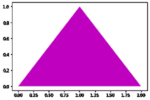

# Python 中的 Matplotlib.pyplot.fill()函数

> 原文:[https://www . geeksforgeeks . org/matplotlib-pyplot-fill-function-in-python/](https://www.geeksforgeeks.org/matplotlib-pyplot-fill-function-in-python/)

Matplotlib.pyplot.fill()函数用于填充多边形/曲线包围的区域。

> **语法：** matplotlib.pyplot.fill（*args， data=None， **kwargs）
> 
> **参数:**
> ***参数**:x，y 的序列，【颜色】
> x，y 的序列=遍历由节点的 x 和 y 位置列表定义的多边形或曲线的边界。您可以通过提供多个 x，y，[颜色]组来绘制多个多边形。
> **数据:**可索引对象，可选
> 默认值=无
> 你可以直接以字典的形式提供标注数据。为了更好地理解，请参考示例 2
> 
> **返回:**多边形列表
> 
> **其他参数:**
> *** *夸格斯:**支持多边形面片的所有其他属性。

**例 1:**

## 蟒蛇 3

```py
# Importing the library
import matplotlib
import matplotlib.pyplot as plt
import numpy as np

# Data for plotting
x = np.arange(0.0, 2.0, 0.01)
y = 1 + np.sin(2 * np.pi * x)
plt.plot(x, y)

# Assighning plot attributes
plt.xlabel("angle")
plt.ylabel("sine")
plt.title('sine wave')

# Filling sign wave curv with cyan color
plt.fill(x, y, "c")
plt.show()
```

**输出:**



示例 1 _ 输出 _GFG

**例 2:**

## 蟒蛇 3

```py
# Importing libraries
import matplotlib
import matplotlib.pyplot as plt

# Below we are using data attribute
plt.fill("j", "k", 'm',
         data={"j": [0, 1, 2],
               "k": [0, 1, 0]})  # here 'm' for magenta
```

**输出:**



示例 2 _ 输出 _GFG