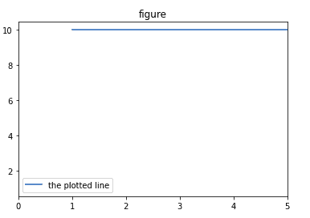

# Matplotlib.pyplot.findobj()用 Python

表示

> 哎哎哎:# t0]https://www . geeksforgeeks . org/matplot lib-pyplot-findobj-in-python/

[**Matplotlib**](http://geeksforgeeks.org/python-matplotlib-an-overview/) 是 Python 中一个惊人的可视化库，用于数组的 2D 图。Matplotlib 绘图库是一个基于 NumPy 阵列的多平台数据可视化库，旨在与更广泛的 SciPy 堆栈协同工作。

## matplotlib.pyplot.findobj()

该函数用于递归查找艺术家中包含的所有艺术家实例。创建过滤器来匹配艺术家对象，该对象查找并返回匹配艺术家的列表。艺术家对象是指`matplotlib.artist`类中负责在画布上渲染颜料的对象。

> **语法:**matplotlib . pyplot . find obj(o =无，match =无，include_self=True)
> 
> **参数:**
> 
> 1.  **匹配:**此参数用于创建过滤器，以匹配搜索到的艺术家对象。这可以是三件事之一；
>     *   **无:**这将返回艺术家中的所有对象。
>     *   **一个函数:**一个带有 def match 等签名的函数(艺术家:Artist) - >布尔。此函数的结果包含函数返回真的艺术家。
>     *   **一个类实例:**这个结果包含同一个类的艺术家或它的一个子类(isinstance check)，例如，Line2D
> 2.  **include_self:** 该参数接受一个布尔值，并且它包括它自己来检查匹配列表。
> 
> **返回:**返回艺术家列表

**例 1:**

```py
import matplotlib.pyplot as plt
import numpy as np

h = plt.figure()

plt.plot(range(1,11),
         range(1,11), 
         gid = 'dummy_data')

legend = plt.legend(['the plotted line'])

plt.title('figure')  

axis = plt.gca()
axis.set_xlim(0,5)

for p in set(h.findobj(lambda x: x.get_gid() == 'dummy_data')):
   p.set_ydata(np.ones(10)*10.0)

plt.show()
```

**输出:**



**例 2:**

```py
import numpy as np
import matplotlib.pyplot as plt
import matplotlib.text as text

m = np.arange(3, -4, -.2)
n = np.arange(3, -4, -.2)
o = np.exp(m)
p = o[::-1]

figure, axes = plt.subplots()
plt.plot(m, o, 'k--', m, p, 
         'k:', m, o + p, 'k')

plt.legend((' Modelset', 'Dataset',
            'Total string length'),
           loc ='upper center', 
           shadow = True)
plt.ylim([-1, 10])
plt.grid(True)
plt.xlabel(' Modelset --->')
plt.ylabel(' String length --->')
plt.title('Min. Length of String')

# Helper function
def find_match(x):
    return hasattr(x, 'set_color') and not hasattr(x, 'set_facecolor')

# calling the findobj function
for obj in figure.findobj(find_match):
    obj.set_color('black')

# match on class instances
for obj in figure.findobj(text.Text):
    obj.set_fontstyle('italic')

plt.show()
```

**输出:**
