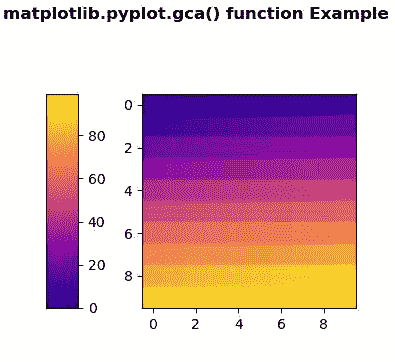
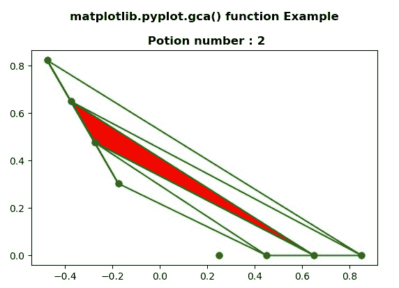

# Matplotlib.pyplot.gca()用 Python

表示

> 哎哎哎:# t0]https://www . geeksforgeeks . org/matplot lib-pyplot-GCA-in-python/

[**Matplotlib**](https://www.geeksforgeeks.org/python-introduction-matplotlib/) 是 Python 中的一个库，它是 NumPy 库的数字-数学扩展。 [**Pyplot**](https://www.geeksforgeeks.org/pyplot-in-matplotlib/) 是一个基于状态的接口，连接到 **Matplotlib** 模块，该模块提供类似于 MATLAB 的接口。

### matplotlib.pyplot.gca()函数

matplotlib 库 pyplot 模块中的 **gca()函数**用于获取当前图形上与给定关键字 args 匹配的当前 Axes 实例，或者创建一个。

> **语法:**matplotlib . pyplot . GCA(\ * \ * kwargs)
> T3】参数:此方法不接受任何参数。
> **返回:**该方法不返回值。

下面的例子说明了 matplotlib.pyplot.gca()函数在 matplotlib.pyplot:

**示例#1:**

## 蟒蛇 3

```py
# Implementation of matplotlib function
import matplotlib.pyplot as plt
import numpy as np
import matplotlib.gridspec as gridspec
from mpl_toolkits.axes_grid1 import make_axes_locatable

plt.close('all')
arr = np.arange(100).reshape((10, 10))
fig = plt.figure(figsize =(4, 4))
im = plt.imshow(arr,
                interpolation ="none",
                cmap ="plasma")

divider = make_axes_locatable(plt.gca())
cax = divider.append_axes("left",
                          "15 %",
                          pad ="30 %")

plt.colorbar(im, cax = cax)

fig.suptitle('matplotlib.pyplot.gca() function\
Example\n\n', fontweight ="bold")
plt.show()
```

**输出:**



**例 2:**

## 蟒蛇 3

```py
# Implementation of matplotlib function
import matplotlib.pyplot as plt
from matplotlib.tri import Triangulation
from matplotlib.patches import Polygon
import numpy as np

def update_polygon(tri):

    if tri == -1:
        points = [0, 0, 0]
    else:
        points = triang.triangles[tri]

    xs = triang.x[points]
    ys = triang.y[points]
    polygon.set_xy(np.column_stack([xs, ys]))

def motion_notify(event):

    if event.inaxes is None:
        tri = -1
    else:
        tri = trifinder(event.xdata, event.ydata)

    update_polygon(tri)
    plt.title('matplotlib.pyplot.gca() function \
    Example\n\n Potion number : % i' % tri,
              fontweight ="bold")

    event.canvas.draw()

ang = 3
radi = 8
radii = np.linspace(0.25, 0.95, radi)
res = np.linspace(0, 4 * np.pi, ang)
res = np.repeat(res[..., np.newaxis], radi, axis = 1)
res[:, 1::2] += np.pi / ang

x = (radii * np.cos(2 * res)).flatten()
y = (radii * np.sin(2 * res)).flatten()
triang = Triangulation(x, y)
triang.set_mask(np.hypot(x[triang.triangles].mean(axis = 1),
                         y[triang.triangles].mean(axis = 1))
                < 0.25)

trifinder = triang.get_trifinder()

plt.subplot(111, aspect ='equal')
plt.triplot(triang, 'go-')
polygon = Polygon([[0, 0], [0, 0]],
                  facecolor ='r')
update_polygon(-1)

plt.gca().add_patch(polygon)
plt.gcf().canvas.mpl_connect('motion_notify_event',
                             motion_notify)

plt.show()
```

**输出:**

