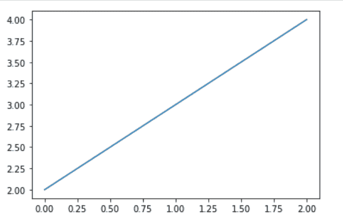
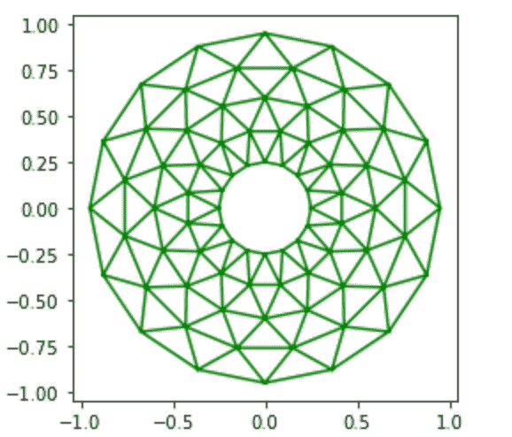

# Matplotlib.pyplot.gcf()用 Python

表示

> 哎哎哎:# t0]https://www . geeksforgeeks . org/matplot lib-pyplot-GCF-in-python/

**Matplotlib** 是 Python 中一个惊人的可视化库，用于数组的 2D 图。 [Matplotlib](https://www.geeksforgeeks.org/python-matplotlib-an-overview/) 是一个基于 NumPy 数组构建的多平台数据可视化库，旨在与更广泛的 SciPy 堆栈协同工作。

## matplotlib.pyplot.gcf()

**matplotlib.pyplot.gcf()** 主要用来获取当前的数字。如果没有可用的当前图形，则在`figure()`功能的帮助下创建一个。

**语法:**

```
matplotlib.pyplot.gcf()
```

**例 1:**

```
import numpy as np
from matplotlib.backends.backend_agg import FigureCanvasAgg
import matplotlib.pyplot as plot

plot.plot([2, 3, 4])

# implementation of the 
# matplotlib.pyplot.gcf()
# function
figure = plot.gcf().canvas

ag = figure.switch_backends(FigureCanvasAgg)
ag.draw()
A = np.asarray(ag.buffer_rgba())

# Pass off to PIL.
from PIL import Image
img = Image.fromarray(A)

# show image
img.show()
```

**输出:**


**例 2:**

```
import matplotlib.pyplot as plt
from matplotlib.tri import Triangulation
from matplotlib.patches import Polygon
import numpy as np

# helper function to update 
# the polygon
def polygon_updater(tr):
    if tr == -1:
        points = [0, 0, 0]
    else:
        points = tri.triangles[tr]
    x_axis = tri.x[points]
    y_axis = tri.y[points]
    polygon.set_xy(np.column_stack([x_axis, y_axis]))

# helper function to set the motion 
# of polygon
def motion_handler(e):
    if e.inaxes is None:
        tr = -1
    else:
        tr = trifinder(e.xdata, e.ydata)
    polygon_updater(tr)
    e.canvas.draw()

# Making the  Triangulation.
all_angles = 16
all_radii = 5
minimum_radii = 0.25
radii = np.linspace(minimum_radii, 0.95, all_radii)
triangulation_angles = np.linspace(0, 2 * np.pi,
                                   all_angles,
                                   endpoint = False)

triangulation_angles = np.repeat(triangulation_angles[...,
                                                      np.newaxis],
                                 all_radii, axis = 1)

triangulation_angles[:, 1::2] += np.pi / all_angles
a = (radii * np.cos(triangulation_angles)).flatten()
b = (radii * np.sin(triangulation_angles)).flatten()
tri = Triangulation(a, b)
tri.set_mask(np.hypot(a[tri.triangles].mean(axis = 1),
                         b[tri.triangles].mean(axis = 1))
                < minimum_radii)

# Useing TriFinder object from 
# Triangulation
trifinder = tri.get_trifinder()

# Setting up the plot and the callbacks.
plt.subplot(111, aspect ='equal')
plt.triplot(tri, 'g-')

 # dummy data for (x-axis, y-axis)
polygon = Polygon([[0, 0], [0, 0]], 
                  facecolor ='b') 
polygon_updater(-1)
plt.gca().add_patch(polygon)

# implementation of the matplotlib.pyplot.gcf() function
plt.gcf().canvas.mpl_connect('motion_notification',
                             motion_handler)
plt.show()
```

**输出:**
