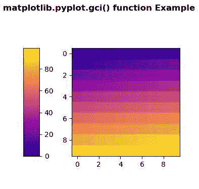
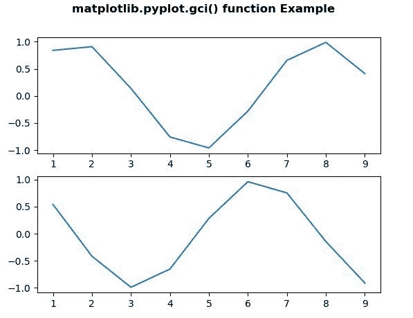

# Matplotlib.pyplot.gci()用 Python

表示

> 哎哎哎:# t0]https://www . geeksforgeeks . org/matplot lib-pyplot-gci-in-python/

**[Matplotlib](https://www.geeksforgeeks.org/python-introduction-matplotlib/)** 是 Python 中的一个库，是 NumPy 库的数值-数学扩展。 **[Pyplot](https://www.geeksforgeeks.org/pyplot-in-matplotlib/)** 是一个基于状态的 Matplotlib 模块接口，它提供了一个类似 MATLAB 的接口。Pyplot 中可以使用的各种图有线图、等高线图、直方图、散点图、三维图等。

## matplotlib.pyplot.gci()方法

matplotlib 库 pyplot 模块中的 **gci()方法**用于获取当前可着色的艺术家。

> **语法:** matplotlib.pyplot.gci()
> 
> **参数:**此方法不接受任何参数。
> 
> **返回:**此方法返回当前可着色的艺术家。

下面的例子说明了 matplotlib.pyplot.gci()函数在 matplotlib.pyplot 中的作用:

**例 1:**

```py
# Implementation of matplotlib function 
import matplotlib.pyplot as plt 
import numpy as np 
import matplotlib.gridspec as gridspec 
from mpl_toolkits.axes_grid1 import make_axes_locatable 

plt.close('all') 
arr = np.arange(100).reshape((10, 10)) 
fig = plt.figure(figsize =(4, 4)) 
im = plt.imshow(arr,  
                interpolation ="none", 
                cmap ="plasma") 

divider = make_axes_locatable(plt.gca()) 
cax = divider.append_axes("left",  
                          "15 %", 
                          pad ="30 %") 

plt.colorbar(im, cax = cax) 

print("The current colorable artist is :")
print(plt.gci())

fig.suptitle('matplotlib.pyplot.gci() function \
Example\n\n', fontweight ="bold") 

plt.show() 
```

**输出:**


```py
The current colorable artist is :
AxesImage(50, 44;310x308)

```

**例 2:**

```py
# Implementation of matplotlib function
import matplotlib.pyplot as plt
from scipy import sin, cos

fig, ax = plt.subplots(2, 1)
x = [1, 2, 3, 4, 5, 6, 7, 8, 9]

y1 = sin(x)
y2 = cos(x)

plt.sca(ax[0])
plt.plot(x, y1)

plt.sca(ax[1])
plt.plot(x, y2)

print("The current colorable artist is :")
print(plt.gci())

fig.suptitle('matplotlib.pyplot.gci() function \
Example\n\n', fontweight ="bold") 

plt.show() 
```

**输出:**


```py
The current colorable artist is :
None

```