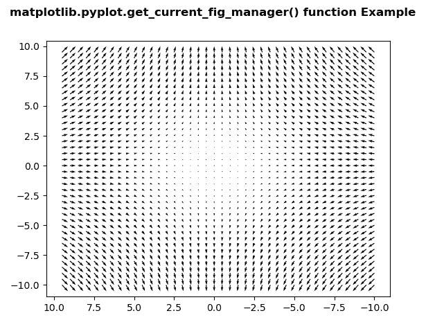
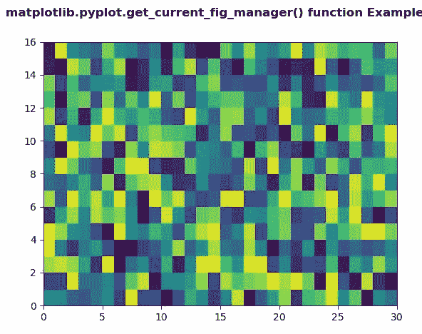

# Python 中的 matplotlib . pyplot . get _ current _ fig _ manager()

> 原文:[https://www . geeksforgeeks . org/matplotlib-pyplot-get _ current _ fig _ manager-in-python/](https://www.geeksforgeeks.org/matplotlib-pyplot-get_current_fig_manager-in-python/)

**[Matplotlib](https://www.geeksforgeeks.org/python-introduction-matplotlib/)** 是 Python 中的一个库，是 NumPy 库的数值-数学扩展。 **[Pyplot](https://www.geeksforgeeks.org/pyplot-in-matplotlib/)** 是一个基于状态的 Matplotlib 模块接口，它提供了一个类似 MATLAB 的接口。Pyplot 中可以使用的各种图有线图、等高线图、直方图、散点图、三维图等。

## matplotlib . pyplot . get _ current _ fig _ manager()方法

matplotlib 库 pyplot 模块中的 **get_current_fig_manager()方法**用于获取当前图形的图形管理器。

> **语法:**matplotlib . pyplot . get _ current _ fig _ manager()
> 
> **参数:**此方法不接受任何参数。
> 
> **返回:**该方法返回当前图形的图形管理器。

下面的例子说明了 matplotlib.pyplot . get _ current _ fig _ manager()函数在 matplotlib . py plot 中的作用:

**例 1:**

```
# Implementation of matplotlib function
import matplotlib.pyplot as plt
import numpy as np

X = np.arange(-10, 10, 0.5)
Y = np.arange(-10, 10, 0.5)
U, V = np.meshgrid(X, Y)

fig, ax = plt.subplots()
ax.quiver(X, Y, U, V)
ax.invert_xaxis() 

w = plt.get_current_fig_manager()

print("Value Return by get_current_fig_manager():")
print(w)

fig.suptitle('matplotlib.pyplot.get_current_fig_manager() \
function Example', fontweight ="bold") 

plt.show()
```

**输出:**


> get_current_fig_manager()返回的值:
> <matplotlib . back ends . _ 后端 _tk。0x07BE6470 处的图管理器对象>

**例 2:**

```
# Implementation of matplotlib function  
import numpy as np  
import matplotlib.pyplot as plt  

xx = np.random.rand(16, 30)  

fig, ax = plt.subplots()  

m = ax.pcolor(xx)  
m.set_zorder(-20)

w = plt.get_current_fig_manager()

print("Value Return by get_current_fig_manager():")
print(w)

fig.suptitle('matplotlib.pyplot.get_current_fig_manager()\
 function Example', fontweight ="bold") 

plt.show()
```

**输出:**


> get_current_fig_manager()返回的值:
> <matplotlib . back ends . _ 后端 _tk。0x08725490 处的图管理器对象>