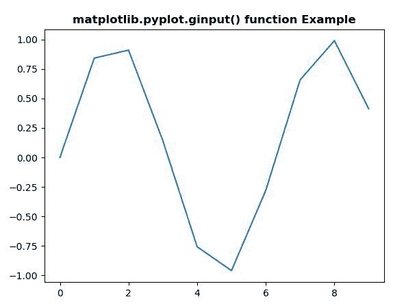
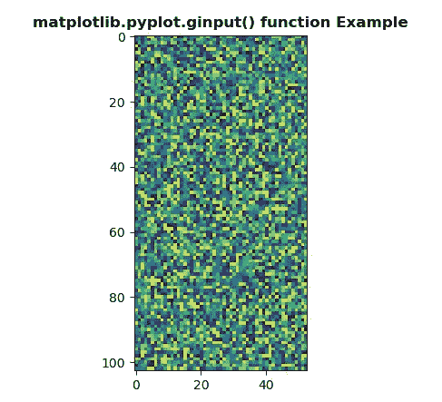

# Matplotlib.pyplot.ginput()用 Python

表示

> 哎哎哎:# t0]https://www . geeksforgeeks . org/matplot lib-pyplot-ginput-in-python/

**[Matplotlib](https://www.geeksforgeeks.org/python-introduction-matplotlib/)** 是 Python 中的一个库，是 NumPy 库的数值-数学扩展。 **[Pyplot](https://www.geeksforgeeks.org/pyplot-in-matplotlib/)** 是一个基于状态的 Matplotlib 模块接口，它提供了一个类似 MATLAB 的接口。Pyplot 中可以使用的各种图有线图、等高线图、直方图、散点图、三维图等。

## matplotlib.pyplot.table()函数

**matplotlib 库的 ginput()方法** pyplot 模块用于阻止调用与图形交互。

> **语法:**matplotlib . pyplot . ginput(n = 1，超时=30，show_clicks=True，mouse_add=1，mouse_pop=3，mouse_stop=2)
> 
> **参数:**该方法接受以下描述的参数:
> 
> *   **n :** 此参数为累计的鼠标点击次数。
> *   **超时:**此参数为超时前等待的秒数。
> *   **show_clicks :** 此参数用于在每次点击的位置显示一个红十字。
> *   **mouse_add :** 此参数是用于添加点的 mouse 按钮。
> *   **mouse_pop :** 此参数是用于移除最近添加的点的 mouse 按钮。
> *   **鼠标 _ 停止:**此参数是用于停止输入的鼠标按钮。
> 
> **返回:**该方法返回被点击的(x，y)坐标列表。

下面的例子说明了 matplotlib.pyplot.ginput()函数在 matplotlib.pyplot 中的作用:

**例 1:**

```
# Implementation of matplotlib function
import matplotlib.pyplot as plt
import numpy as np
t = np.arange(10)

plt.plot(t, np.sin(t))

plt.title('matplotlib.pyplot.ginput()\
 function Example', fontweight ="bold")

print("After 3 clicks :")
x = plt.ginput(3)
print(x)

plt.show()
```

**输出:**



```
After 3 clicks :
[(4.460080645161289, 0.5915838985273842), 
(4.460080645161289, 0.5915838985273842), 
(4.460080645161289, 0.5915838985273842)]

```

**例 2:**

```
# Implementation of matplotlib function
import matplotlib.pyplot as plt
import numpy as np

np.random.seed(10**7)

x1 = np.random.rand(103, 53) 

plt.title('matplotlib.pyplot.ginput() function\
 Example', fontweight ="bold")

print("After 2 clicks :")
plt.imshow(x1)
x = plt.ginput(2) 
print(x)

plt.show()
```

**输出:**



```
After 2 clicks :
[(8.443181818181813, 38.90530303030302), 
(8.443181818181813, 38.90530303030302)]

```