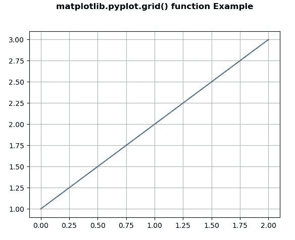
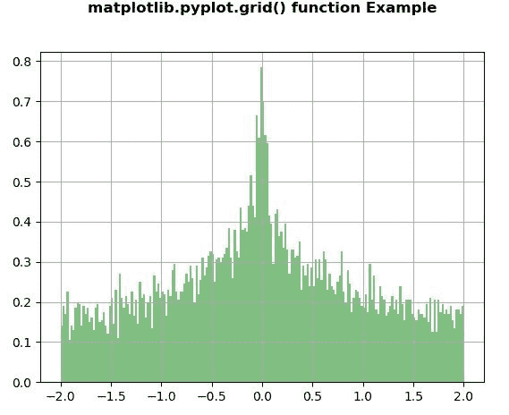

# Matplotlib.pyplot.grid()中的 Python

> 哎哎哎:# t0]https://www . geeksforgeeks . org/matplot lib-pyplot-grid-in-python/

**[Matplotlib](https://www.geeksforgeeks.org/python-introduction-matplotlib/)** 是 Python 中的一个库，是 NumPy 库的数值-数学扩展。 **[Pyplot](https://www.geeksforgeeks.org/pyplot-in-matplotlib/)** 是一个基于状态的接口到 **Matplotlib** 模块，它提供了一个类似于 MATLAB 的接口。

## matplotlib.pyplot.grid()函数

matplotlib 库 pyplot 模块中的**网格()功能**用于配置网格线。

> **语法:**matplotlib . pyplot . grid(b = None，其中='major '，axis='both '，\*\*kwargs)
> 
> **参数:**该方法接受以下参数。
> 
> *   **b :** 该参数为可选参数，是否显示网格线。
> *   **哪个:**这个参数也是可选参数，是要应用更改的网格线。
> *   **轴:**该参数也是可选参数，是应用更改的轴。
> 
> **返回:**该方法不返回值。

下面的例子说明了 matplotlib.pyplot.grid()函数在 matplotlib.pyplot 中的作用:

**示例#1:**

```py
# Implementation of matplotlib function   
import matplotlib.pyplot as plt
import numpy as np

plt.plot([1, 2, 3])
plt.grid()

plt.title('matplotlib.pyplot.grid() function \
Example\n\n', fontweight ="bold")
plt.show()
```

**输出:**


**例 2:**

```py
# Implementation of matplotlib function   
import numpy as np
import matplotlib.pyplot as plt

np.random.seed(19680801)

val, res = 100, 15
x = np.sin(val + res * np.random.randn(10000)) - np.cos(val + res * np.random.randn(10000))

n, bins, patches = plt.hist(x, 200, 
                            density = True, 
                            facecolor ='g', 
                            alpha = 0.5)

plt.grid(True)

plt.title('matplotlib.pyplot.grid() function \
Example\n\n', fontweight ="bold")

plt.show()
```

**输出:**
