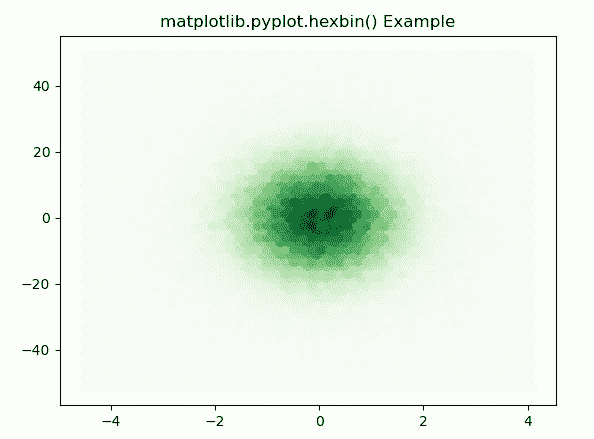
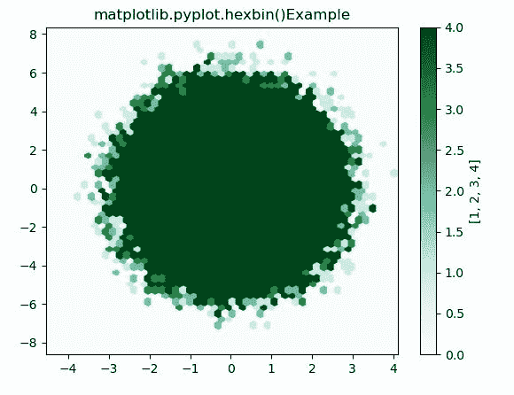

# Python 中的 Matplotlib.pyplot.hexbin()函数

> 原文:[https://www . geeksforgeeks . org/matplotlib-pyplot-hex bin-python 中的函数/](https://www.geeksforgeeks.org/matplotlib-pyplot-hexbin-function-in-python/)

[**Matplotlib**](https://www.geeksforgeeks.org/python-introduction-matplotlib/) 是 Python 中的一个库，是 NumPy 库的数值-数学扩展。 [**Pyplot**](https://www.geeksforgeeks.org/pyplot-in-matplotlib/) 是一个基于状态的接口到 **Matplotlib** 模块，它提供了一个类似于 MATLAB 的接口。Pyplot 中可以使用的各种图有线图、等高线图、直方图、散点图、三维图等。

## Matplotlib.pyplot.hexbin（）

matplotlib 库 pyplot 模块中的 **hexbin()函数**用于制作点 x，y.
的 2D 六边形宁滨图

> **语法:** matplotlib.pyplot.hexbin(x，y，C=None，gridsize=100，bins =None，xscale='linear '，yscale='linear '，extent=None，cmap=None，norm=None，vmin=None，vmax=None，alpha=None，线宽= None，edgecolors='face '，reduce_C_function=，mincnt=None，marginals=False，*，data=None，* * * kwargs)
> 
> **参数:**该方法接受以下描述的参数:
> 
> *   **x，y:** 这些参数是数据的序列。x 和 y 的长度必须相同。
> *   **C :** 该参数是箱中累积的值。
> *   **gridsize :** 此参数表示 x 方向或两个方向的六边形数量。
> *   **xscale :** 此参数在横轴上使用线性或 log10 刻度。
> *   **xycale :** 此参数在垂直轴上使用线性或 log10 刻度。
> *   **mincnt :** 此参数用于显示单元格中点数超过 mincnt 的单元格。
> *   **边缘:**此参数用于将边缘密度绘制为沿 x 轴底部和 y 轴左侧的彩色矩形。
> *   **范围:**该参数是箱的极限。
> 
> **返回:**这将返回以下内容:
> 
> *   **多集合:**返回定义六边形面元的多集合。

下面的例子说明了 matplotlib.pyplot.hexbin()函数在 matplotlib.pyplot:

**例 1:**

## 蟒蛇 3

```py
# Implementation of matplotlib function 
import matplotlib.pyplot as plt 
import numpy as np 

np.random.seed(19680801) 

n = 100000
x = np.random.standard_normal(n) 
y = 12 * np.random.standard_normal(n) 

plt.hexbin(x, y, gridsize = 50, cmap ='Greens') 
plt.title('matplotlib.pyplot.hexbin() Example') 
plt.show() 
```

**输出:**



**例 2:**

## 蟒蛇 3

```py
# Implementation of matplotlib function 
import matplotlib.pyplot as plt 
import numpy as np 

np.random.seed(19680801) 

n = 100000
x = np.random.standard_normal(n) 
y = 2 * np.random.standard_normal(n) 
z =[1, 2, 3, 4] 
xmin = x.min() 
xmax = x.max() 
ymin = y.min() 
ymax = y.max() 

hb = plt.hexbin(x, y, gridsize = 50, 
               bins = z, cmap ='BuGn') 

plt.xlim(xmin, xmax)
plt.ylim(ymin, ymax)

cb = plt.colorbar(hb) 
cb.set_label(z)
plt.title('matplotlib.pyplot.hexbin()\
Example')

plt.show()
```

**输出:**

