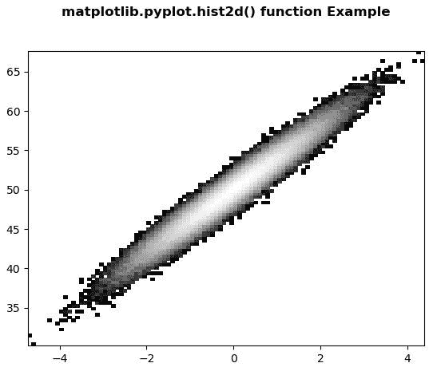
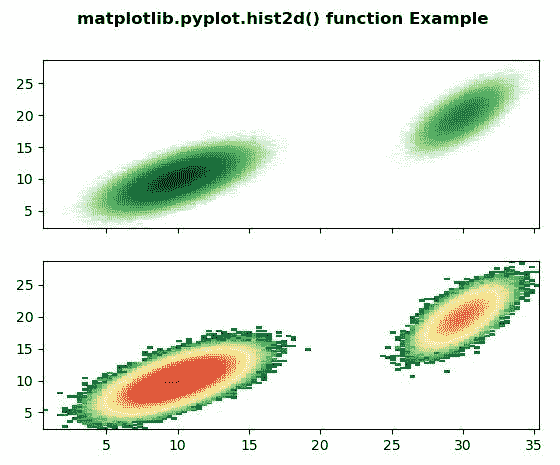

# Matplotlib.pyplot.hist2d()中的 Python

> 哎哎哎:# t0]https://www . geeksforgeeks . org/matplot lib-pyplot-hist 2d-in-python/

**[Matplotlib](https://www.geeksforgeeks.org/python-introduction-matplotlib/)** 是 Python 中的一个库，是 NumPy 库的数值-数学扩展。 **[Pyplot](https://www.geeksforgeeks.org/pyplot-in-matplotlib/)** 是一个基于状态的接口到 **Matplotlib** 模块，它提供了一个类似于 MATLAB 的接口。

## matplotlib.pyplot.hist2d()函数

matplotlib 库 pyplot 模块中的 **hist2d()函数**用于制作 2d 直方图。

> **语法:** matplotlib.pyplot.hist2d(x，y，bins = 10，范围=无，密度=假，权重=无，cmin =无，cmax =无，\*，数据=无，\*\*kwargs)
> 
> **参数:**该方法接受以下描述的参数:
> 
> *   **x，y :** 这些参数是数据的序列。
> *   **bin:**该参数为可选参数，包含整数或序列或字符串。
> *   **范围:**该参数是可选参数，它是箱的下限和上限。
> *   **密度:**该参数为可选参数，包含布尔值。
> *   **权重:**该参数是可选参数，是权重数组，形状与 x 相同。
> *   **cmin :** 该参数有计数小于 cmin 的所有箱将不会显示。
> *   **cmax :** 该参数有计数超过 cmax 的所有箱将不会显示。
> 
> **返回:**这将返回以下内容:
> 
> *   **h :** 这将返回样本 x 和 y 的二维直方图。
> *   **xedges :** 这将返回沿 x 轴的料箱边缘。
> *   **yedges :** 这将返回沿 y 轴的料箱边缘。
> *   **图像:**这将返回四边网格。

下面的例子说明了 matplotlib.pyplot.hist2d()函数在 matplotlib.pyplot 中的作用:

**示例#1:**

```py
# Implementation of matplotlib function
from matplotlib import colors
from matplotlib.ticker import PercentFormatter
import numpy as np
import matplotlib.pyplot as plt

N_points = 100000
x = np.random.randn(N_points)
y = 4 * x + np.random.randn(100000) + 50

plt.hist2d(x, y,
           bins = 100, 
           norm = colors.LogNorm(), 
           cmap ="gray")

plt.title('matplotlib.pyplot.hist2d() function \
Example\n\n', fontweight ="bold")

plt.show()
```

**输出:**


**例 2:**

```py
#Implementation of matplotlib function
from matplotlib import colors
import numpy as np
from numpy.random import multivariate_normal
import matplotlib.pyplot as plt

result = np.vstack([
    multivariate_normal([10, 10],
            [[3, 2], [2, 3]], size=1000000),
    multivariate_normal([30, 20],
            [[2, 3], [1, 3]], size=100000)
])

plt.hist2d(result[:, 0],
           result[:, 1],
           bins = 100, 
           cmap = "Greens",
           norm = colors.LogNorm())
plt.title('matplotlib.pyplot.hist2d function \
Example')
plt.show()

plt.hist2d(result[:, 0], 
           result[:, 1],
           bins = 100, 
           cmap = "RdYlGn_r",
           norm = colors.LogNorm())
plt.show()
```

**输出:**
