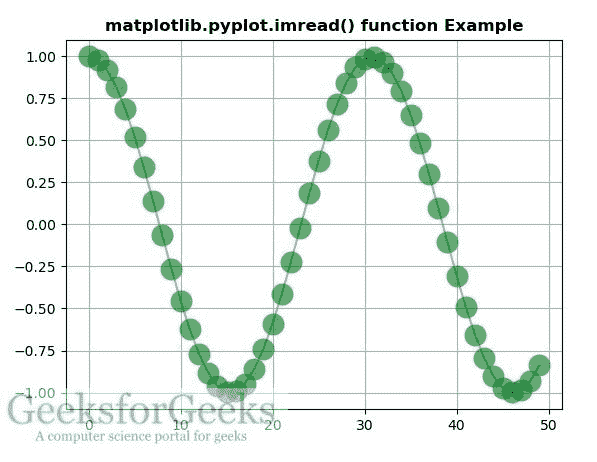

# matplotlib.pyplot.imread()用 Python

表示

> 哎哎哎:# t0]https://www . geeksforgeeks . org/matplot lib-pyplot-im read-in-python/

**[Matplotlib](https://www.geeksforgeeks.org/python-introduction-matplotlib/)** 是 Python 中的一个库，是 NumPy 库的数值-数学扩展。 **[Pyplot](https://www.geeksforgeeks.org/pyplot-in-matplotlib/)** 是一个基于状态的接口到 **Matplotlib** 模块，它提供了一个类似于 MATLAB 的接口。

## matplotlib.pyplot.imread()函数:

matplotlib 库 pyplot 模块中的 **imread()函数**用于将文件中的图像读入数组。

> **语法:**matplotlib . pyplot . imread(fname，format=None)
> 
> **参数:**该方法接受以下参数。
> 
> *   **fname :** 这个参数是要读取的图像文件。
> *   **格式:**该参数为读取数据时假设的图像文件格式。
> 
> **返回:**该方法返回以下内容。
> 
> *   **图像数据:**返回图像数据

下面的例子说明了 matplotlib.pyplot.imread()函数在 matplotlib.pyplot 中的作用:

**示例#1:**

```py
# Implementation of matplotlib function
import numpy as np
import matplotlib.cbook as cbook
import matplotlib.image as image
import matplotlib.pyplot as plt

with cbook.get_sample_data('loggf.png') as image_file:
    image = plt.imread(image_file)

fig, ax = plt.subplots()
ax.imshow(image)
ax.axis('off')

plt.title('matplotlib.pyplot.imread() function Example', 
                                     fontweight ="bold")
plt.show()
```

**输出:**


**例 2:**

```py
# Implementation of matplotlib function
import numpy as np
import matplotlib.cbook as cbook
import matplotlib.image as image
import matplotlib.pyplot as plt

with cbook.get_sample_data('loggf.png') as file:
    im = image.imread(file)

fig, ax = plt.subplots()

ax.plot(np.cos(10 * np.linspace(0, 1)), '-o', ms = 15,
                            alpha = 0.6, mfc ='green')

ax.grid()
fig.figimage(im, 10, 10, zorder = 3, alpha =.5)

plt.title('matplotlib.pyplot.imread() function Example', 
                                     fontweight ="bold")
plt.show()
```

**输出:**
