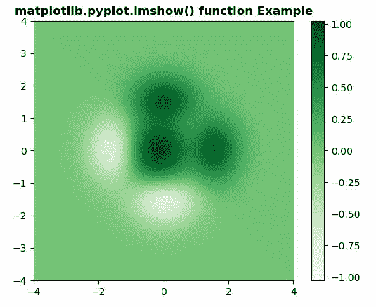
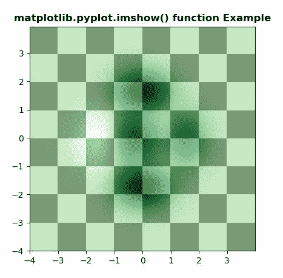

# matplotlib.pyplot.imshow()在 Python

中

> 哎哎哎:# t0]https://www . geeksforgeeks . org/matplot lib-pyplot-im show-in-python/

**[Matplotlib](https://www.geeksforgeeks.org/python-introduction-matplotlib/)** 是 Python 中的一个库，是 NumPy 库的数值-数学扩展。 **[Pyplot](https://www.geeksforgeeks.org/pyplot-in-matplotlib/)** 是一个基于状态的接口到 **Matplotlib** 模块，它提供了一个类似于 MATLAB 的接口。

## matplotlib.pyplot.imshow()函数:

matplotlib 库 pyplot 模块中的 **imshow()函数**用于将数据显示为图像；即在 2D 规则光栅上。

> **语法:** matplotlib.pyplot.imshow(X，cmap =无，norm=无，aspect =无，插值=无，alpha =无，vmin =无，vmax =无，原点=无，范围=无，shape=，filternorm=1，filterrad=4.0，imlim=，重采样=无，url =无，\*，data =无，*\*kwargs)
> 
> **参数:**该方法接受以下描述的参数:
> 
> *   **X:** 这个参数是图像的数据。
> *   **cmap :** 此参数是一个 colormap 实例或注册的 colormap 名称。
> *   **norm :** 此参数是 Normalize 实例，它将数据值缩放到标准颜色映射范围[0，1]，以映射到颜色
> *   **vmin，vmax :** 这些参数本质上是可选，它们是 colorbar 范围。
> *   **alpha :** 此参数是颜色的强度。
> *   **纵横比:**该参数用于控制轴的纵横比。
> *   **插值:**该参数是用来显示图像的插值方法。
> *   **原点:**此参数用于将数组的[0，0]索引放置在轴的左上角或左下角。
> *   **重采样:**该参数是用于相似的方法。
> *   **范围:**该参数是数据坐标中的包围盒。
> *   **filternorm :** 此参数用于反锯齿图像调整大小滤镜。
> *   **filterrad :** 此参数是具有半径参数的过滤器的过滤器半径。
> *   **网址:**该参数设置创建的**轴图像的网址。**
> 
> **返回:**这将返回以下内容:
> 
> *   **图像:**这将返回**轴图像**

下面的例子说明了 matplotlib.pyplot.imshow()函数在 matplotlib.pyplot 中的作用:

**示例#1:**

```py
# Implementation of matplotlib function
import matplotlib.pyplot as plt
import numpy as np
from matplotlib.colors import LogNorm

dx, dy = 0.015, 0.05
y, x = np.mgrid[slice(-4, 4 + dy, dy),
                slice(-4, 4 + dx, dx)]
z = (1 - x / 3\. + x ** 5 + y ** 5) * np.exp(-x ** 2 - y ** 2)
z = z[:-1, :-1]
z_min, z_max = -np.abs(z).max(), np.abs(z).max()

c = plt.imshow(z, cmap ='Greens', vmin = z_min, vmax = z_max,
                 extent =[x.min(), x.max(), y.min(), y.max()],
                    interpolation ='nearest', origin ='lower')
plt.colorbar(c)

plt.title('matplotlib.pyplot.imshow() function Example', 
                                     fontweight ="bold")
plt.show()
```

**输出:**


**例 2:**

```py
# Implementation of matplotlib function
import matplotlib.pyplot as plt
import numpy as np
from matplotlib.colors import LogNorm

dx, dy = 0.015, 0.05
x = np.arange(-4.0, 4.0, dx)
y = np.arange(-4.0, 4.0, dy)
X, Y = np.meshgrid(x, y)

extent = np.min(x), np.max(x), np.min(y), np.max(y)

Z1 = np.add.outer(range(8), range(8)) % 2
plt.imshow(Z1, cmap ="binary_r", interpolation ='nearest',
                               extent = extent, alpha = 1)

def geeks(x, y):
    return (1 - x / 2 + x**5 + y**6) * np.exp(-(x**2 + y**2))

Z2 = geeks(X, Y)

plt.imshow(Z2, cmap ="Greens", alpha = 0.7, 
           interpolation ='bilinear', extent = extent)

plt.title('matplotlib.pyplot.imshow() function Example', 
                                     fontweight ="bold")
plt.show()
```

**输出:**
