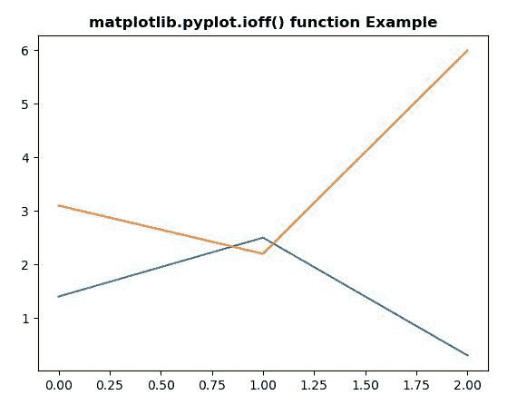
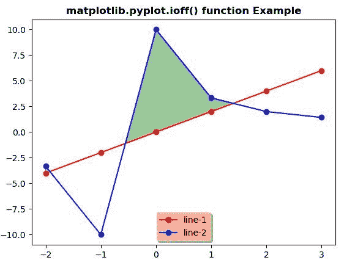

# matplotlib.pyplot.ioff()用 Python

表示

> 哎哎哎:# t0]https://www . geeksforgeeks . org/matplot lib-pyplot-ioff-in-python/

**[Matplotlib](https://www.geeksforgeeks.org/python-introduction-matplotlib/)** 是 Python 中的一个库，是 NumPy 库的数值-数学扩展。 **[Pyplot](https://www.geeksforgeeks.org/pyplot-in-matplotlib/)** 是一个基于状态的接口到 **Matplotlib** 模块，它提供了一个类似于 MATLAB 的接口。

## matplotlib.pyplot.ioff()函数:

matplotlib 库 pyplot 模块中的 **ioff()功能**用于关闭交互模式。

> **语法:** matplotlib.pyplot.ioff()
> 
> **参数:**该方法不接受任何参数。
> 
> **返回:**该方法不返回值。

下面的例子说明了 matplotlib.pyplot.ioff()函数在 matplotlib.pyplot 中的作用:

**示例#1:**

```
# Implementation of matplotlib function
import matplotlib.pyplot as plt
import numpy as np

plt.ioff() 
plt.plot([1.4, 2.5, 0.3])

axes = plt.gca() 
axes.plot([3.1, 2.2, 6])

plt.title('matplotlib.pyplot.ioff() function Example',
                                   fontweight ="bold")

plt.show()
```

**输出:**


**例 2:**

```
# Implementation of matplotlib function
import matplotlib.pyplot as plt
import numpy as np

plt.ioff() 
random_array = np.arange(-2, 4) 
line_1 = random_array * 2
line_2 = 10 / (random_array * 2 + 1) 
figure, axes = plt.subplots() 

axes.plot(random_array, line_1, 
          'ro-', random_array, 
          line_2, 'bo-',  
          linestyle ='solid') 

axes.fill_between(random_array,  
                  line_1,  
                  line_2, 
                  where = line_2>line_1,  
                  interpolate = True, 
                  color ='green', alpha = 0.4) 

lgnd = axes.legend(['line-1', 
                    'line-2'],  
                   loc ='lower center',  
                   shadow = True) 

lgnd.get_frame().set_facecolor('# ffb19a') 
plt.title('matplotlib.pyplot.ioff() function Example', 
                                    fontweight ="bold")
plt.show()
```

**输出:**
