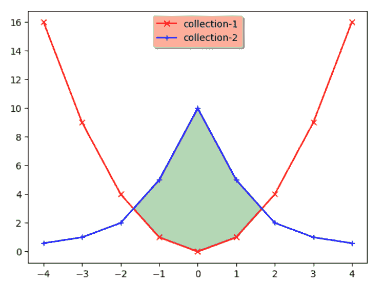
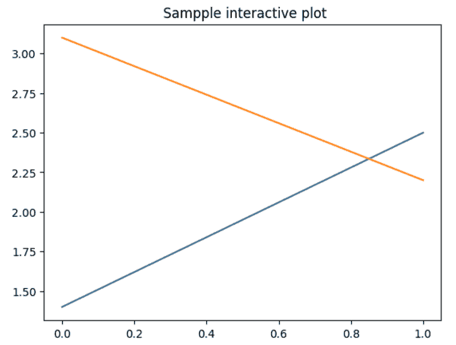

# Matplotlib.pyplot.ion()中的 Python

> 哎哎哎:# t0]https://www . geeksforgeeks . org/matplot lib-pyplot-ion-in-python/

Matplotlib 是一个神奇的 Python 可视化库，用于数组的 2D 图。Matplotlib 是一个多平台数据可视化库，构建在 NumPy 数组上，旨在与更广泛的 SciPy 堆栈一起工作。可视化的最大好处之一是，它允许我们以易于理解的视觉方式可视化访问大量数据。Matplotlib 由几个图组成，如直线、条形图、散点图、直方图等。

**matplotlib.pyplot.ion()** 用于开启交互模式。要检查交互模式的状态，可以运行以下命令，

```
plt.rcParams['interactive']

```

或者，这个命令

```
plt.isinteractive()

```

Matplotlib 还与场景后面的不同后端交互。matplotlib 中渲染图表背后的主力是它的后端。一些交互式后端会动态更新，并在每次更改后弹出给用户。默认情况下，交互模式是关闭的。

**语法:**

> matplotlib.pyplot.ion()

它不接受任何参数。

**例 1:**

```
import matplotlib.pyplot as plt

#the function to turn on interactive mode
plt.ion()

#creating randomly generate collections/data
random_array = np.arange(-4, 5)
collection_1 = random_array ** 2
collection_2 = 10 / (random_array ** 2 + 1)
figure, axes = plt.subplots()

axes.plot(random_array, collection_1,
          'rx', random_array,
          collection_2, 'b+', 
          linestyle='solid')

axes.fill_between(random_array, 
                  collection_1, 
                  collection_2,
                  where=collection_2>collection_1, 
                  interpolate=True,
                  color='green', alpha=0.3)

lgnd = axes.legend(['collection-1',
                    'collection-2'], 
                   loc='upper center', 
                   shadow=True)

lgnd.get_frame().set_facecolor('#ffb19a')
```

**输出:**


**例 2:**

```
import matplotlib.pyplot as plt

plt.ion()
plt.plot([1.4, 2.5])
plt.title(" Sampple interactive plot")

axes = plt.gca()
axes.plot([3.1, 2.2])
```

**输出:**
