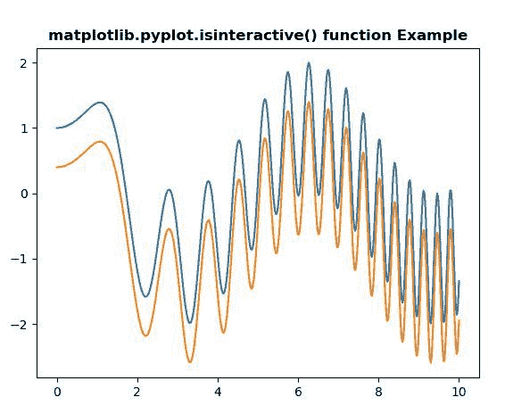
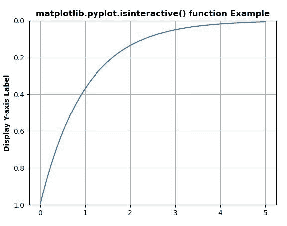

# matplotlib . pyplot . isictive()用 Python

表示

> 哎哎哎:# t0]https://www . geeksforgeeks . org/matplot lib-pyplot-isictivein-python/

**[Matplotlib](https://www.geeksforgeeks.org/python-introduction-matplotlib/)** 是 Python 中的一个库，是 NumPy 库的数值-数学扩展。 **[Pyplot](https://www.geeksforgeeks.org/pyplot-in-matplotlib/)** 是一个基于状态的 Matplotlib 模块接口，它提供了一个类似 MATLAB 的接口。Pyplot 中可以使用的各种图有线图、等高线图、直方图、散点图、三维图等。

## matplotlib . pyplot . is interactive()方法

matplotlib 库 pyplot 模块中的 **isinteractive()方法**用于获取每次出图命令后是否重绘。

> **语法:**matplotlib . pyplot . isiinteractive()
> 
> **参数:**此方法不接受任何参数。
> 
> **返回:**该方法返回是否在每次出图命令后重绘。

下面的例子说明了 matplotlib.pyplot . is interactive()函数在 matplotlib . py plot 中的作用:

**例 1:**

```
# Implementation of matplotlib function
import numpy as np
import matplotlib.pyplot as plt

x = np.linspace(0, 10, 500)
y = np.sin(x**2)+np.cos(x)

plt.plot(x, y, label ='Line 1')

plt.plot(x, y - 0.6, label ='Line 2')

w = plt.isinteractive()

print("Is we can redraw after every plotting command : ",
       str(w))

plt.title('matplotlib.pyplot.isinteractive() function \
Example', fontweight ="bold") 

plt.show()
```

**输出:**


```
Is we can redraw after every plotting command :  False

```

**例 2:**

```
# Implementation of matplotlib function
import matplotlib.pyplot as plt
import numpy as np

t = np.arange(0.01, 5.0, 0.01)
s = np.exp(-t)

plt.plot(t, s)
plt.ylim(1, 0)
plt.ylabel('Display Y-axis Label', fontweight ='bold')
plt.grid(True)

w = plt.isinteractive()

print("Is we can redraw after every plotting command : ",
       str(w))

plt.title('matplotlib.pyplot.isinteractive() function \
Example', fontweight ="bold") 

plt.show()
```

**输出:**


```
Is we can redraw after every plotting command :  False

```