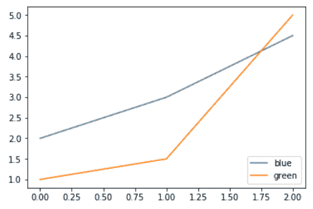
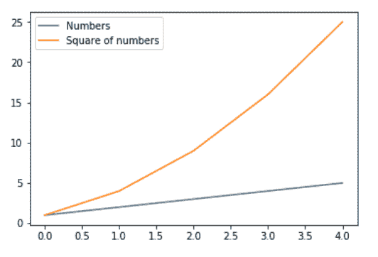
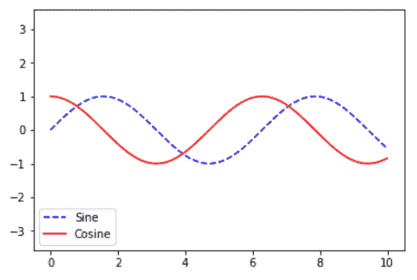
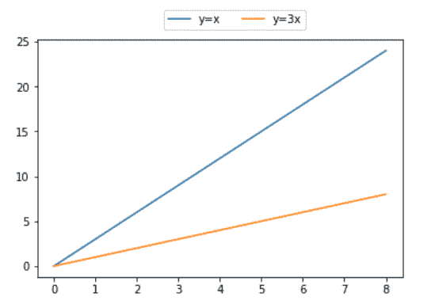

# Matplotlib.pyplot.legend()用 Python

表示

> 哎哎哎:# t0]https://www . geeksforgeeks . org/matplot lib-pyplot-legend-in-python/

**Matplotlib** 是最流行的用于数据可视化的 Python 包之一。这是一个跨平台的库，用于从数组中的数据制作 2D 图。 **Pyplot** 是一组命令风格的函数，使 matplotlib 像 MATLAB 一样工作。每个 pyplot 函数都会对图形进行一些更改:例如，创建图形、在图形中创建绘图区域、在绘图区域中绘制一些线条、用标签装饰图形等。

## Matplotlib.pyplot.legend()

图例是描述图形元素的区域。在 matplotlib 库中，有一个名为**图例()**的函数，用于在轴上放置图例。

`legend()`中的属性 **Loc** 用于指定图例的位置。loc 的默认值是 loc=“最佳”(左上角)。字符串“左上角”、“右上角”、“左下角”、“右下角”将图例放置在轴/图形的相应角落。

图例()函数的属性 **bbox_to_anchor=(x，y)** 用于指定图例的坐标，属性 **ncol** 表示图例的列数。它的默认值是 1。

**语法:**

> matplotlib.pyplot.legend([蓝色、绿色]、bbox_to_anchor=(0.75、1.15)、ncl = 2)

以下是功能`legend()`的更多属性:

*   **阴影**:【无或 bool】是否在传说后面画阴影。它的默认值是无。
*   **标记比例**:【无或整数或浮点数】图例标记与原始绘制的图例标记相比的相对大小。默认值为无。
*   **numpoints**:[无或 int]为线 2D(线)创建图例条目时图例中的标记点数量。默认值为无。
*   **字体大小**:图例的字体大小。如果该值是数字，则大小将是以磅为单位的绝对字体大小。
*   **面颜色**:【无或“继承”或颜色】图例的背景颜色。
*   **边缘颜色**:【无或“继承”或颜色】图例的背景补丁边缘颜色。

#### Python 中图例()函数的使用方法–

**例 1:**

```py
import numpy as np
import matplotlib.pyplot as plt

# X-axis values
x = [1, 2, 3, 4, 5]

# Y-axis values 
y = [1, 4, 9, 16, 25]

# Function to plot  
plt.plot(x, y)

# Function add a legend  
plt.legend(['single element'])

# function to show the plot
plt.show()
```

**输出:**


**例 2:**

```py
# importing modules
import numpy as np
import matplotlib.pyplot as plt

# Y-axis values
y1 = [2, 3, 4.5]

# Y-axis values 
y2 = [1, 1.5, 5]

# Function to plot  
plt.plot(y1)
plt.plot(y2)

# Function add a legend  
plt.legend(["blue", "green"], loc ="lower right")

# function to show the plot
plt.show()
```

**输出:**


**例 3:**

```py
import numpy as np
import matplotlib.pyplot as plt

# X-axis values
x = np.arange(5)

# Y-axis values
y1 = [1, 2, 3, 4, 5]

# Y-axis values 
y2 = [1, 4, 9, 16, 25]

# Function to plot  
plt.plot(x, y1, label ='Numbers')
plt.plot(x, y2, label ='Square of numbers')

# Function add a legend  
plt.legend()

# function to show the plot
plt.show()
```

**输出:**


**例 4:**

```py
import numpy as np
import matplotlib.pyplot as plt

x = np.linspace(0, 10, 1000)
fig, ax = plt.subplots()

ax.plot(x, np.sin(x), '--b', label ='Sine')
ax.plot(x, np.cos(x), c ='r', label ='Cosine')
ax.axis('equal')

leg = ax.legend(loc ="lower left");
```

**输出:**


**例 5:**

```py
# importing modules
import numpy as np
import matplotlib.pyplot as plt

# X-axis values
x = [0, 1, 2, 3, 4, 5, 6, 7, 8]

# Y-axis values
y1 = [0, 3, 6, 9, 12, 15, 18, 21, 24]
# Y-axis values 
y2 = [0, 1, 2, 3, 4, 5, 6, 7, 8]

# Function to plot  
plt.plot(y1, label ="y = x")
plt.plot(y2, label ="y = 3x")

# Function add a legend  
plt.legend(bbox_to_anchor =(0.75, 1.15), ncol = 2)

# function to show the plot
plt.show()
```

**输出:**
