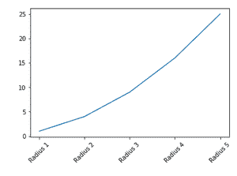
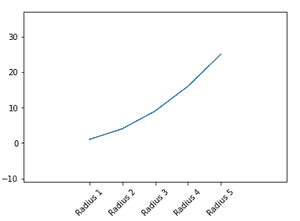
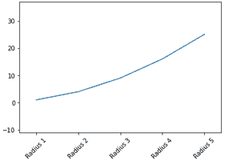
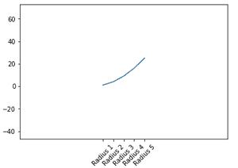

# Python 中的 Matplotlib.pyplot.margins()函数

> 原文:[https://www . geeksforgeeks . org/matplotlib-pyplot-margins-function-in-python/](https://www.geeksforgeeks.org/matplotlib-pyplot-margins-function-in-python/)

**先决条件:**T2【马特洛特利

**Matplotlib . pyplot . margins()**是用于设置 x 轴和 y 轴边距的函数。所有输入参数都必须是范围[0，1]内的浮点数。我们不能同时传递位置参数和关键字参数，因为这会引发类型错误。添加到每个轴限制的填充是该轴的边距乘以数据间隔。如果没有提供参数，现有的边距保持不变。指定边距会改变自动缩放。

*   如果只提供一个浮点值，则该值将作为 x 轴和 y 轴的边距。
*   如果提供了两个浮点值，它们将分别用于指定 x 边距轴和 y 边距轴。

> **语法:**
> 
> 边距(x，y，紧)
> 
> **参数**
> 
> –**x，y** :用于指定 x 轴和 y 轴的边距值。这些只能单独使用。
> 
> –**紧**:布尔型
> 
> *   如果将此参数指定为“真”，则认为指定的边距不需要额外的填充来匹配刻度线。
> *   如果此参数设置为“无”，它将保留原始设置。

下面给出了使用该函数的各种实现:

**示例:**一般应用

## 蟒蛇 3

```
import matplotlib.pyplot as plt

x = [1, 2, 3, 4, 5]
labels = ['Radius 1', 'Radius 2', 'Radius 3', 'Radius 4', 'Radius 5']
y = [i**2 for i in x]

plt.plot(x, y)
plt.xticks(x, labels, rotation=45)
plt.margins()
plt.show()
```

**输出:**



**示例:**将参数传递给 margins()函数

## 蟒蛇 3

```
import matplotlib.pyplot as plt

x = [1, 2, 3, 4, 5]
labels = ['Radius 1', 'Radius 2', 'Radius 3', 'Radius 4', 'Radius 5']
y = [i**2 for i in x]

plt.plot(x, y)
plt.xticks(x, labels, rotation=45)
plt.margins(0.5)
plt.show()
```

**输出:**



**示例**:通过 x 和 y 小于 1 的不同值，生成的图形将被放大

## 蟒蛇 3

```
import matplotlib.pyplot as plt

x = [1, 2, 3, 4, 5]
labels = ['Radius 1', 'Radius 2', 'Radius 3', 'Radius 4', 'Radius 5']
y = [i**2 for i in x]

plt.plot(x, y)
plt.xticks(x, labels, rotation=45)
plt.margins(x=0.1, y=0.5)
plt.show()
```

**输出:**



**示例:**传递大于的 x 和 y 的不同值，生成的图形将被缩小

## 蟒蛇 3

```
import matplotlib.pyplot as plt

x = [1, 2, 3, 4, 5]
labels = ['Radius 1', 'Radius 2', 'Radius 3', 'Radius 4', 'Radius 5']
y = [i**2 for i in x]

plt.plot(x, y)
plt.xticks(x, labels, rotation=45)
plt.margins(x=2, y=2)
plt.show()
```

**输出:**

