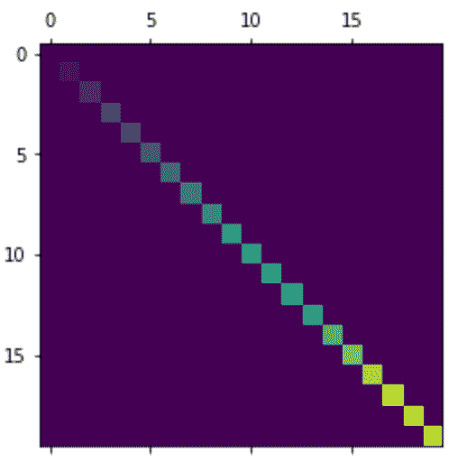
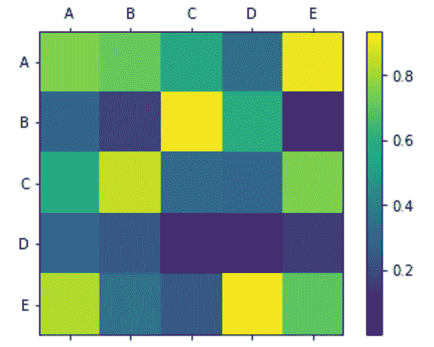

# Matplotlib.pyplot.matshow()用 Python

表示

> 哎哎哎:# t0]https://www . geeksforgeeks . org/matplot lib-pyplot-matshow-in-python/

**Matplotlib** 是 Python 中一个惊人的可视化库，用于数组的 2D 图。 [Matplotlib](http://geeksforgeeks.org/python-matplotlib-an-overview/) 是一个基于 NumPy 数组构建的多平台数据可视化库，旨在与更广泛的 SciPy 堆栈协同工作。它是由约翰·亨特在 2002 年推出的。

## matplotlib.pyplot.matshow（）

**matplotlib . pyplot . matshow()**函数用于在新的图形窗口中将数组表示为矩阵。左上角被设置为原点，行(数组的第一维)以水平形式显示。图形窗口的长宽比是根据数组设置的，以避免图形过短过窄。x 轴刻度标签位于顶部。

> **语法:** matplotlib.pyplot.matshow(A，fignum=None，**kwargs)
> **参数:**
> 
> 1.  **A:** :是表示矩阵的类似数组的对象。这是必需的参数。
> 2.  **fignum:** 它接受三个值，即“无”、“假”或一个整数值。如果该值设置为“无”，将创建一个自动编号的新图形窗口。如果该值是非零整数，那么它将被绘制到相应于给定数字的图形中，或者如果它不存在，则创建它。如果“0”被设置为该参数的值，则它使用当前轴，如果不存在，则创建一个轴。
> 
> **返回:**返回 Axesimage 类的图像。
> **其他参数:**它也接受 imshow 显示图像的说法。

**例 1:**

## 蟒蛇 3

```py
import matplotlib.pyplot as plot
import numpy as np

# an array with linearly increasing values
array = np.diag(range(20))

plot.matshow(array)

plot.show()
```

**输出:**



**例 2:**

## 蟒蛇 3

```py
import numpy as np
import matplotlib.pyplot as plt

alphabets = ['A', 'B', 'C', 'D', 'E']

# randomly generated array
random_array = np.random.random((5, 5))

figure = plt.figure()
axes = figure.add_subplot(111)

# using the matshow() function
caxes = axes.matshow(random_array, interpolation ='nearest')
figure.colorbar(caxes)

axes.set_xticklabels(['']+alphabets)
axes.set_yticklabels(['']+alphabets)

plt.show()
```

**输出:**

