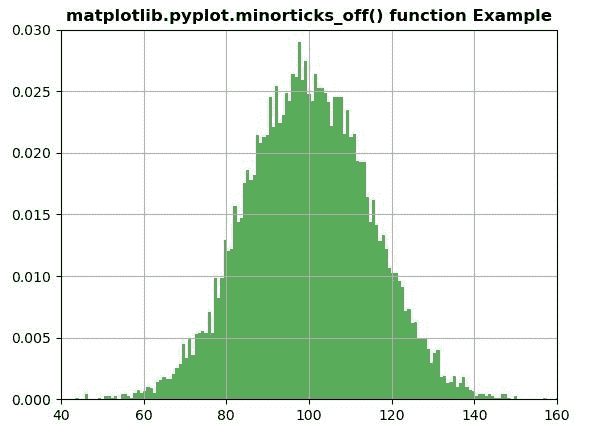
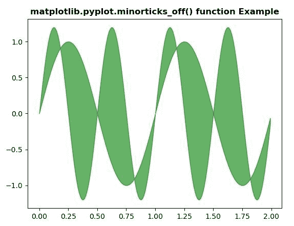

# Python 中的 matplotlib . pyplot . minarticks _ off()

> 原文:[https://www . geeksforgeeks . org/matplotlib-pyplot-minorticks _ off-in-python/](https://www.geeksforgeeks.org/matplotlib-pyplot-minorticks_off-in-python/)

**[Matplotlib](https://www.geeksforgeeks.org/python-introduction-matplotlib/)** 是 Python 中的一个库，是 NumPy 库的数值-数学扩展。 **[Pyplot](https://www.geeksforgeeks.org/pyplot-in-matplotlib/)** 是一个基于状态的接口到 **Matplotlib** 模块，它提供了一个类似于 MATLAB 的接口。

## matplotlib . pyplot . minarticks _ off()函数:

matplotlib 库中 pyplot 模块中的**minarticks _ off()函数**用于从轴上移除次要记号..

> **语法:**matplotlib . pyplot . minarticks _ off()
> 参数:此方法不接受任何参数。
> **返回值:**此方法不返回值。
> 
> **注意:使用 minorticks_on()功能后，如果使用该功能，将显示任何变化或效果。**

下面的例子说明了 matplotlib.pyplot . min articks _ off()函数在 matplotlib . py plot 中的作用:

**示例#1:**

```
# Implementation of matplotlib function
import numpy as np
import matplotlib.pyplot as plt

plt.minorticks_on()

np.random.seed(19680801)
mu, sigma = 100, 15
x = mu + sigma * np.random.randn(10000)

plt.hist(x, 150, density = True, facecolor ='g', alpha = 0.65)

plt.xlim(40, 160)
plt.ylim(0, 0.03)
plt.grid(True)

plt.minorticks_off()
plt.title('matplotlib.pyplot.minorticks_off() function Example', 
                                             fontweight ="bold")
plt.show()
```

**输出:**


**例 2:**

```
# Implementation of matplotlib function
import matplotlib.pyplot as plt
import numpy as np

x = np.arange(0.0, 2, 0.01)
y1 = np.sin(2 * np.pi * x)
y2 = 1.2 * np.sin(4 * np.pi * x)

plt.minorticks_on() 
plt.fill_between(x, y1, y2, color ="green", alpha = 0.6)
plt.minorticks_off()
plt.title('matplotlib.pyplot.minorticks_off() function Example',
                                             fontweight ="bold")
plt.show()
```

**输出:**
