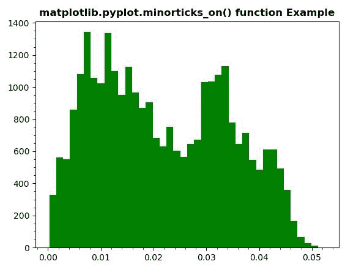
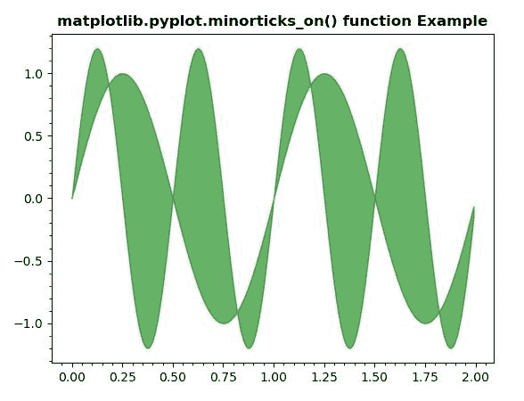

# Python 中的 matplotlib . pyplot . minarticks _ on()

> 原文:[https://www . geeksforgeeks . org/matplotlib-pyplot-min articks _ on-in-python/](https://www.geeksforgeeks.org/matplotlib-pyplot-minorticks_on-in-python/)

**[Matplotlib](https://www.geeksforgeeks.org/python-introduction-matplotlib/)** 是 Python 中的一个库，是 NumPy 库的数值-数学扩展。 **[Pyplot](https://www.geeksforgeeks.org/pyplot-in-matplotlib/)** 是一个基于状态的接口到 **Matplotlib** 模块，它提供了一个类似于 MATLAB 的接口。

## matplotlib . pyplot . minarticks _ on()函数:

matplotlib 库 pyplot 模块中的**minarticks _ on()函数**用于显示轴上的次要刻度。

> **语法:**
> 
> ```py
> matplotlib.pyplot.minorticks_on()
> 
> ```
> 
> **参数:**该方法不接受任何参数。
> 
> **返回值:**此方法不返回值。

下面的例子说明了 matplotlib.pyplot . min articks _ on()函数在 matplotlib . py plot 中的作用:

**示例#1:**

```py
# Implementation of matplotlib function
import numpy as np
import matplotlib.pyplot as plt
import matplotlib.cbook as cbook
import matplotlib.cm as cm

from matplotlib.collections import LineCollection
from matplotlib.ticker import MultipleLocator

with cbook.get_sample_data('s1045.ima.gz') as dfile:
    im = np.frombuffer(dfile.read(), np.uint16).reshape((256, 256))

im = np.ravel(im)
im = im[np.nonzero(im)] 
im = im / (2**20 - 1)
plt.hist(im, bins = 40, color ="green")

plt.minorticks_on()
plt.title('matplotlib.pyplot.minorticks_on() function Example', fontweight ="bold")
plt.show()
```

**输出:**


**例 2:**

```py
# Implementation of matplotlib function
import matplotlib.pyplot as plt
import numpy as np

x = np.arange(0.0, 2, 0.01)
y1 = np.sin(2 * np.pi * x)
y2 = 1.2 * np.sin(4 * np.pi * x)

plt.fill_between(x, y1, y2, color ="green", alpha = 0.6)

plt.minorticks_on()
plt.title('matplotlib.pyplot.minorticks_on() function Example', fontweight ="bold")
plt.show()
```

**输出:**
