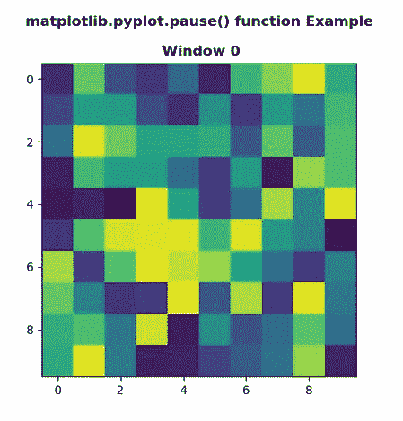
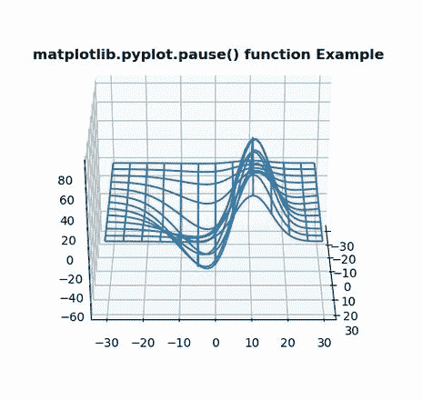

# matplotlib.pyplot.pause()用 Python

表示

> 哎哎哎:# t0]https://www . geeksforgeeks . org/matplotlib-pyplot-in-python/中的暂停

**[Matplotlib](https://www.geeksforgeeks.org/python-introduction-matplotlib/)** 是 Python 中的一个库，是 NumPy 库的数值-数学扩展。 **[Pyplot](https://www.geeksforgeeks.org/pyplot-in-matplotlib/)** 是一个基于状态的接口到 **Matplotlib** 模块，它提供了一个类似于 MATLAB 的接口。

## matplotlib.pyplot.pause()函数:

matplotlib 库 pyplot 模块中的**暂停()功能**用于暂停间隔秒。

> **语法:**
> 
> ```py
> matplotlib.pyplot.pause(interval)
> 
> ```
> 
> **参数:**该方法不接受任何参数。
> 
> **返回值:**此方法不返回值。

下面的例子说明了 matplotlib.pyplot.pause()函数在 matplotlib.pyplot 中的作用:

**示例#1:**

```py
# Implementation of matplotlib function
import numpy as np
import matplotlib.pyplot as plt

np.random.seed(19)
data = np.random.random((5, 10, 10))

for i in range(len(data)):
    plt.cla()
    plt.title('matplotlib.pyplot.pause() function Example\n\n Window {}'.format(i), fontweight ="bold")
    plt.imshow(data[i])
    plt.pause(0.1)
```

**输出:**


**例 2:**

```py
# Implementation of matplotlib function
from mpl_toolkits.mplot3d import axes3d
import matplotlib.pyplot as plt

fig = plt.figure()
ax = fig.add_subplot(111, projection ='3d')

X, Y, Z = axes3d.get_test_data(0.1)
ax.plot_wireframe(X, Y, Z, rstride = 5, cstride = 5)

for angle in range(0, 360):
    ax.view_init(30, angle)
    plt.draw()
    plt.pause(.001)
    ax.set_title('matplotlib.pyplot.pause() function Example', fontweight ="bold")
```

**输出:**
