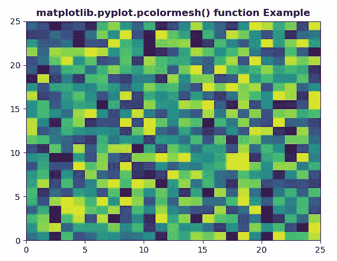
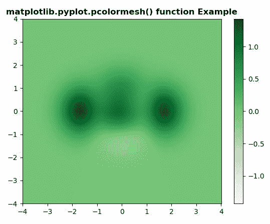

# matplotlib . pyplot . pcolormesh()用 Python

表示

> 哎哎哎:# t0]https://www . geeksforgeeks . org/matplot lib-pyplot-pcolormesh-in-python/

**[Matplotlib](https://www.geeksforgeeks.org/python-introduction-matplotlib/)** 是 Python 中的一个库，是 NumPy 库的数值-数学扩展。 **[Pyplot](https://www.geeksforgeeks.org/pyplot-in-matplotlib/)** 是一个基于状态的接口到 **Matplotlib** 模块，它提供了一个类似于 MATLAB 的接口。

## matplotlib.pyplot.pcolormesh()函数:

matplotlib 库 pyplot 模块中的 **pcolormesh()函数**用于创建一个非规则矩形网格的伪彩色图。

> **语法:**
> 
> ```py
> matplotlib.pyplot.pcolormesh(\*args, alpha=None, norm=None, cmap=None, vmin=None, vmax=None, shading='flat', antialiased=False, data=None, \*\*kwargs)
> 
> ```
> 
> **参数:**该方法接受以下描述的参数:
> 
> *   **C :** 此参数包含 2D 阵列中要进行颜色映射的值。
> *   **X，Y:** 这些参数是四边形角的坐标。
> *   **cmap :** 此参数是一个 colormap 实例或注册的 colormap 名称。
> *   **norm :** 此参数是 Normalize 实例，它将数据值缩放到标准颜色映射范围[0，1]，以映射到颜色
> *   **vmin，vmax :** 这些参数本质上是可选，它们是 colorbar 范围。
> *   **alpha :** 此参数是颜色的强度。
> *   **捕捉:**此参数用于将网格捕捉到像素边界。
> *   **边缘颜色:**该参数是边缘的颜色。{ '无'，无，'脸'，颜色，颜色序列}
> *   **底纹:**此参数为填充样式。它可以是平的或高的。
> 
> **返回:**这将返回以下内容:
> 
> *   **网格:**这将返回**网格**

下面的例子说明了 matplotlib.pyplot.pcolormesh()函数在 matplotlib.pyplot 中的作用:

**示例#1:**

```py
# Implementation of matplotlib function
import matplotlib.pyplot as plt
import numpy as np
from matplotlib.colors import LogNorm

Z = np.random.rand(25, 25)

plt.pcolormesh(Z)

plt.title('matplotlib.pyplot.pcolormesh() function Example', fontweight ="bold")
plt.show()
```

**输出:**


**例 2:**

```py
# Implementation of matplotlib function
import matplotlib.pyplot as plt
import numpy as np
from matplotlib.colors import LogNorm

dx, dy = 0.015, 0.05
y, x = np.mgrid[slice(-4, 4 + dy, dy),
                slice(-4, 4 + dx, dx)]
z = (1 - x / 3\. + x ** 6 + y ** 3) * np.exp(-x ** 2 - y ** 2)
z = z[:-1, :-1]
z_min, z_max = -np.abs(z).max(), np.abs(z).max()

c = plt.pcolormesh(x, y, z, cmap ='Greens', vmin = z_min, vmax = z_max)
plt.colorbar(c)

plt.title('matplotlib.pyplot.pcolormesh() function Example', fontweight ="bold")
plt.show()
```

**输出:**
