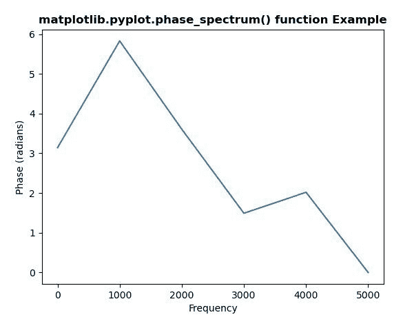
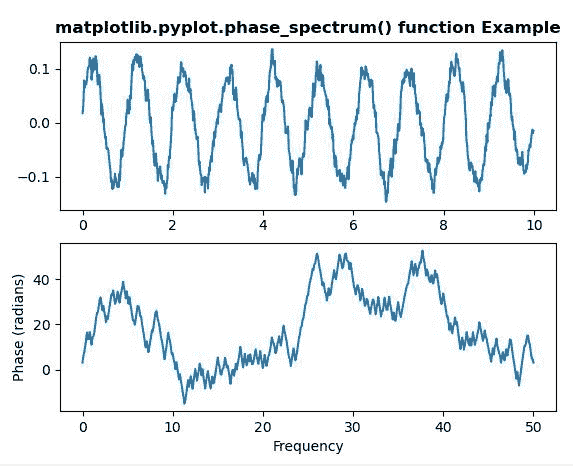

# Python 中的 matplotlib . pyplot . phase _ spectrum()

> 原文:[https://www . geeksforgeeks . org/matplotlib-pyplot-phase _ spectrum-in-python/](https://www.geeksforgeeks.org/matplotlib-pyplot-phase_spectrum-in-python/)

**[Matplotlib](https://www.geeksforgeeks.org/python-introduction-matplotlib/)** 是 Python 中的一个库，是 NumPy 库的数值-数学扩展。 **[Pyplot](https://www.geeksforgeeks.org/pyplot-in-matplotlib/)** 是一个基于状态的接口到 **Matplotlib** 模块，它提供了一个类似于 MATLAB 的接口。Pyplot 中可以使用的各种图有线图、等高线图、直方图、散点图、三维图等。

## matplotlib . pyplot . phase _ spectrum()函数:

matplotlib 库 pyplot 模块中的**相位谱()函数**用于绘制相位谱。一般是计算序列的相位谱，然后作图。

> **语法:** phase_spectrum(x，Fs=2，Fc=0，window=mlab.window_hanning，pad_to=None，sides='default '，**kwargs)
> 
> **参数:**该方法接受以下描述的参数:
> 
> *   **x:** 这个参数是一个数据序列。
> *   **Fs :** 此参数为标量。它的默认值是 2。
> *   **窗口:**该参数以一个数据段为自变量，返回该段的窗口版本。其默认值为 *window_hanning()*
> *   **边:**此参数指定要返回光谱的哪些边。这可以有以下值:“默认值”、“单侧”和“双侧”。
> *   **pad_to :** 此参数包含数据段填充到的整数值。
> *   **Fc:** 该参数还包含偏移绘图 x 范围的整数值，以反映频率范围。其默认值为 *0*
> 
> **返回:**这将返回以下内容:
> 
> *   **光谱:**以弧度为单位返回角度光谱。
> *   **频率:**返回频谱中元素对应的频率。
> *   **行:**返回该函数创建的行。

结果是**(光谱，频率，线)**

下面的例子说明了 matplotlib.pyplot . phase _ spectrum()函数在 matplotlib . py plot 中的作用:

**示例-1:**

```py
# Implementation of matplotlib function
import matplotlib.pyplot as plt
import numpy as np

np.random.seed(10**5)

dt = 0.0001
Fs = 1 / dt

geeks = np.array([24.40, 110.25, 20.05, 22.00, 61.90,
                   7.80, 15.00, 22.80, 34.90, 57.30])

nse = np.random.randn(len(geeks))
r = np.exp(-geeks / 0.05)

s = 0.1 * np.sin(2 * np.pi * geeks) + nse

# plot phase_spectrum
plt.phase_spectrum(s, Fs = Fs)
plt.title('matplotlib.pyplot.phase_spectrum() function Example',
                                             fontweight ="bold")

plt.show()
```

**输出:**


**示例-2:**

```py
# Implementation of matplotlib function
import matplotlib.pyplot as plt
import numpy as np

np.random.seed(0)

dt = 0.01
Fs = 1 / dt
t = np.arange(0, 10, dt)
nse = np.random.randn(len(t))
r = np.exp(-t / 0.05)

cnse = np.convolve(nse, r)*dt
cnse = cnse[:len(t)]
s = 0.1 * np.sin(2 * np.pi * t) + cnse

# plot simple spectrum
plt.subplot(2, 1, 1)
plt.plot(t, s)
plt.title('matplotlib.pyplot.phase_spectrum() function Example', 
                                             fontweight ="bold")

plt.subplot(2, 1, 2)
plt.phase_spectrum(s, Fs = Fs)

plt.show()
```

**输出:**
