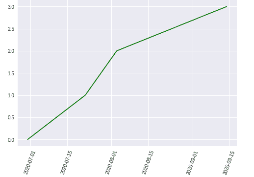
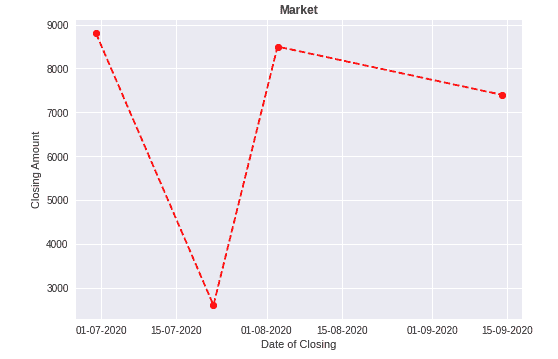

# Python 中的 Matplotlib.pyplot.plot_date()函数

> 原文:[https://www . geeksforgeeks . org/matplotlib-pyplot-plot _ date-python 中的函数/](https://www.geeksforgeeks.org/matplotlib-pyplot-plot_date-function-in-python/)

Matplotlib 是 python 中用于数据可视化的模块、包或库。 [Pyplot](https://www.geeksforgeeks.org/pyplot-in-matplotlib/) 是一个 Matplotlib 模块的接口，提供了一个类似 MATLAB 的接口。

## Matplotlib.pyplot.plot_date （）

该功能用于向绘图中添加日期。

**语法:**

> *matplot lib . pyplot . plot _ date(x，y，fmt='o '，tz=None，xdate=true，ydate=False，data=None，**kwargs)*

这是日期函数的语法。它包含各种参数或参数，解释如下。

<figure class="table">

| 

#### No.

 | 

#### parameter/independent variable

 | 

#### Description

 |
| 1. | x，y | x 和 y 都是数据的坐标，即 x 轴水平，y 轴垂直。 |
| 2. | fmt | 它是一个可选的字符串参数，包含相应的绘图细节，如颜色、样式等。 |
| 3.

 | 坦桑尼亚 | tz 代表用于标注日期的时区，默认为(UTC)。 |
| 4. | xdate | xdate 参数包含布尔值。如果 xdate 为真，则 x 轴在 matplotlib 中解释为日期。默认情况下，xdate 为真。 |
| 5. | 还有你们 | 如果 ydate 为真，则 y 轴在 matplotlib 中解释为日期。默认情况下，ydate 为 false。 |
| 6. | 数据 | 将用于绘图的数据。 |

</figure>

最后一个参数**kwargs 是控制 Line2D 属性的关键字参数，如动画、dash_ joint-style、颜色、线宽、线型、标记等。

**例 1:**

## 蟒蛇 3

```py
# importing libraries
import matplotlib.pyplot as plt
from datetime import datetime

# creating array of dates for x axis
dates = [
    datetime(2020, 6, 30),
    datetime(2020, 7, 22),
    datetime(2020, 8, 3),
    datetime(2020, 9, 14)
]

# for y axis
x = [0, 1, 2, 3]

plt.plot_date(dates, x, 'g')
plt.xticks(rotation=70)
plt.show()
```

**输出:**



**示例 2:** 使用数据集创建图。

## 蟒蛇 3

```py
# importing libraries
import pandas as pd
import matplotlib.pyplot as plt
from datetime import datetime

# creating a dataframe
data = pd.DataFrame({'Date': [datetime(2020, 6, 30),
                              datetime(2020, 7, 22),
                              datetime(2020, 8, 3),
                              datetime(2020, 9, 14)],

                     'Close': [8800, 2600, 8500, 7400]})

# x-axis
price_date = data['Date']

# y-axis
price_close = data['Close']

plt.plot_date(price_date, price_close, linestyle='--', color='r')
plt.title('Market', fontweight="bold")
plt.xlabel('Date of Closing')
plt.ylabel('Closing Amount')

plt.show()
```

#### 输出:


**示例 3:** 更改日期格式:

## 蟒蛇 3

```py
# importing libraries
import pandas as pd
import matplotlib.pyplot as plt
from datetime import datetime

# creating a dataframe
data = pd.DataFrame({'Date': [datetime(2020, 6, 30), 
                              datetime(2020, 7, 22), 
                              datetime(2020, 8, 3),
                              datetime(2020, 9, 14)],

                     'Close': [8800, 2600, 8500, 7400]})

# x-axis
price_date = data['Date']

# y-axis
price_close = data['Close']

plt.plot_date(price_date, price_close, linestyle='--', color='r')
plt.title('Market', fontweight="bold")
plt.xlabel('Date of Closing')
plt.ylabel('Closing Amount')

# Changing the formate of the date using
# dateformatter class
format_date = mpl_dates.DateFormatter('%d-%m-%Y')

# getting the accurate current axes using gca()
plt.gca().xaxis.set_major_formatter(format_date)

plt.show()
```

**输出:**



日期格式更改为日-月-年。要了解更多关于[数据格式器](https://www.geeksforgeeks.org/matplotlib-dates-dateformatter-class-in-python/)和 [gca()](https://www.geeksforgeeks.org/matplotlib-pyplot-gca-in-python/) 的信息，请点击此处。