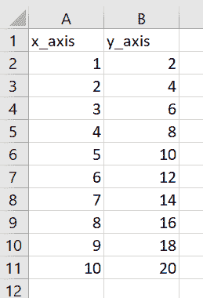
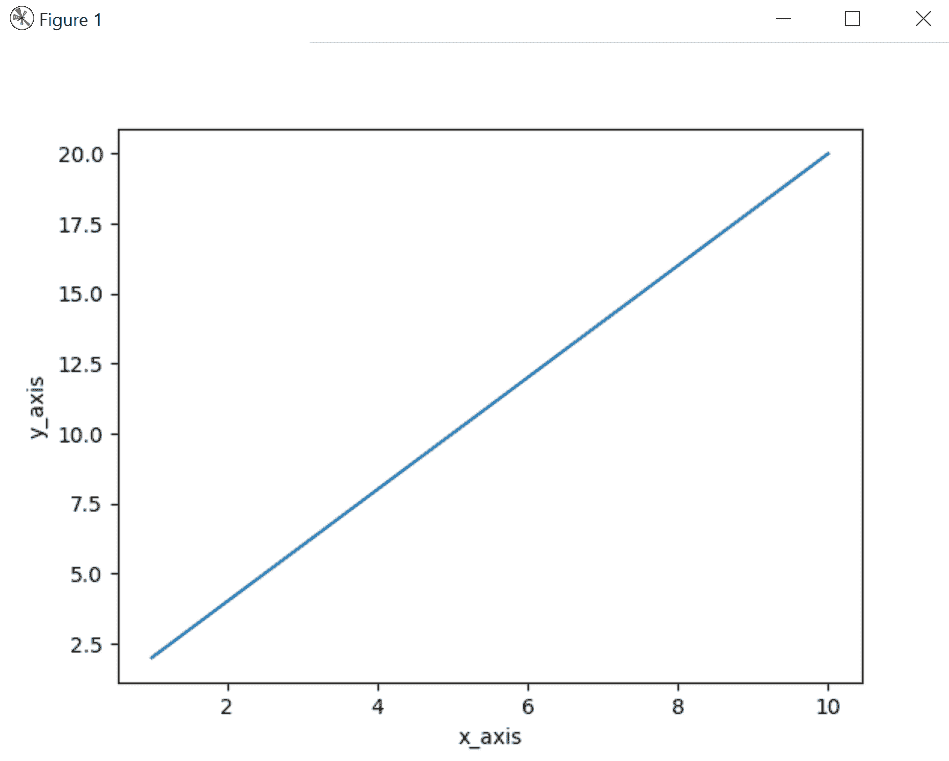
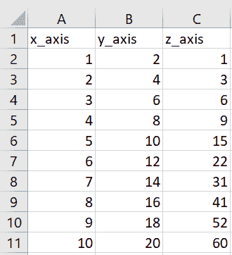
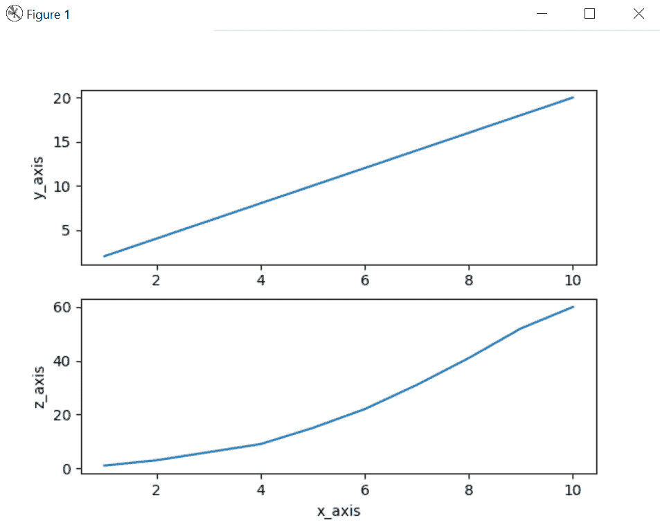

# Matplotlib.pyplot.plotfile()用 Python

表示

> 哎哎哎:# t0]https://www . geeksforgeeks . org/matplotlib-pyplot-python 打印文件/

借助`**pyplot.plotfile()**`方法，我们可以直接从给定的 csv 文件中绘制图形，我们不必使用`pyplot.plotfile()`方法为特定属性制作单独的数据框。

> **语法:** `pyplot.plotfile(datafile, (attr1, attr2, .....attrn))`
> 
> **返回:**返回图形上的属性图。

**示例#1:**
在这个示例中，我们可以看到，通过使用`pyplot.plotfile()`方法，我们能够通过使用`pyplot.plotfile()`方法给定的属性在图形上绘制 csv 文件数据。

```py
# import matplotlib
import matplotlib.pyplot as plt

# Provide the location of datafile
data = 'location_of_data_file'

# Using pyplot.plotfile() method
plt.plotfile(data, ('x_axis', 'y_axis'))
plt.show()
```

**示例#1 的数据文件:**



**输出:**



**例 2 :**

```py
# import matplotlib
import matplotlib.pyplot as plt

# Provide the location of datafile
data = 'location_of_data_file'

# Using pyplot.plotfile() method
plt.plotfile(data, ('x_axis', 'y_axis', 'z_axis'))
plt.show()
```

**示例#2 的数据文件:**



**输出:**

