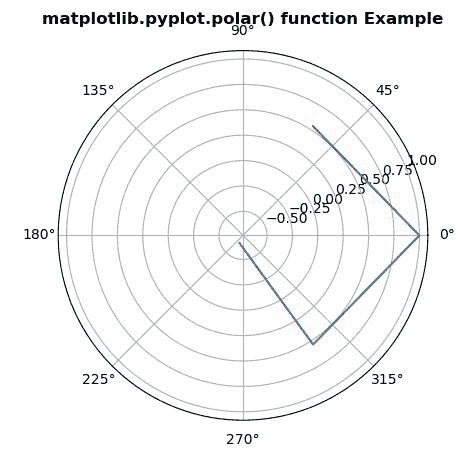

# matplotlib.pyplot.polar()用 Python

表示

> 哎哎哎:# t0]https://www . geeksforgeeks . org/matplot lib-pyplot-polar-in-python/

**[Matplotlib](https://www.geeksforgeeks.org/python-introduction-matplotlib/)** 是 Python 中的一个库，是 NumPy 库的数值-数学扩展。 **[Pyplot](https://www.geeksforgeeks.org/pyplot-in-matplotlib/)** 是一个基于状态的接口到 **Matplotlib** 模块，它提供了一个类似于 MATLAB 的接口。

## matplotlib.pyplot.polar()函数:

matplotlib 库 pyplot 模块中的**极坐标()函数**用于制作极坐标图。

> **语法:**matplotlib . pyplot . polar(* args、**kwargs)
> 
> **参数:**此方法不接受任何参数。
> 
> **返回:**此方法不返回任何值。

下面的例子说明了 matplotlib.pyplot.polar()函数在 matplotlib.pyplot 中的作用:

**示例#1:**

```py
# Implementation of matplotlib function
import matplotlib.pyplot as plt
import matplotlib.transforms as mtransforms
import numpy as np

from matplotlib.transforms import offset_copy

xs = np.arange(-2, 2)
ys = np.cos(xs**2)
plt.polar(xs, ys) 

plt.title('matplotlib.pyplot.polar() function Example',
                                    fontweight ="bold")
plt.show()
```

**输出:**


**例 2:**

```py
# Implementation of matplotlib function
import matplotlib.pyplot as plt
import matplotlib.transforms as mtransforms
import numpy as np

from matplotlib.transforms import offset_copy

xs = np.arange(8)
ys = np.cos(xs**2)

fig = plt.figure(figsize =(5, 10))
ax = plt.subplot(1, 1, 1)

trans_offset = mtransforms.offset_copy(ax.transData, fig = fig,
                                       y = 6, units ='dots')

for x, y in zip(xs, ys):
    plt.polar(x, y, 'go')
    plt.text(x, y, '% d, % d' % (int(x), int(y)),
                       transform = trans_offset,
                  horizontalalignment ='center',
                    verticalalignment ='bottom')

plt.title('matplotlib.pyplot.polar() function Example', 
                                    fontweight ="bold")
plt.show()
```

**输出:**
