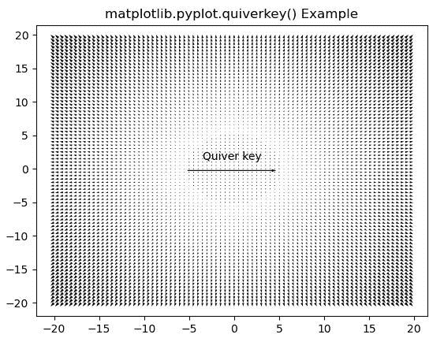
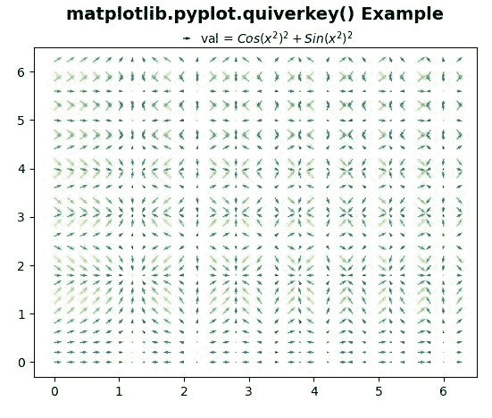

# matplotlib . pyplot . quiverey()用 Python

表示

> 哎哎哎:# t0]https://www . geeksforgeeks . org/matplot lib-pyplot-quiverey-in-python/

**[Matplotlib](https://www.geeksforgeeks.org/python-introduction-matplotlib/)** 是 Python 中的一个库，是 NumPy 库的数值-数学扩展。 **[Pyplot](https://www.geeksforgeeks.org/pyplot-in-matplotlib/)** 是一个基于状态的接口到 **Matplotlib** 模块，它提供了一个类似于 MATLAB 的接口。Pyplot 中可以使用的各种图有线图、等高线图、直方图、散点图、三维图等。

## matplotlib.pyplot.quiverkey()函数

matplotlib 库 pyplot 模块中的 **quiverkey()函数**用于为颤图添加一个键。

> **语法:**matplotlib . pyplot . quiverey(q，x，y，u，label，**kw)
> 
> **参数:**该方法接受以下描述的参数:
> 
> *   **Q:** 这个参数是对颤的调用返回的颤实例。
> *   **X，Y :** 这些参数是按键位置的 X 和 Y 坐标。
> *   **U:** 此参数为按键长度。
> *   **标签:**该参数是一个字符串，带有密钥的长度和单位。
> *   **角度:**此参数为箭头的角度。
> *   **颜色:**该参数是来自于 q 的覆盖面和边缘颜色
> *   **标签页:**该参数用于将标签定位在箭头的上方、下方、右侧、左侧。
> *   **标签页:**此参数是箭头和标签之间的距离，单位为英寸。
> *   **标签颜色:**默认为默认文本颜色。
> *   **fontproperties:** 这个参数是 fontproperties 初始化器接受的带有关键字参数的字典:系列、样式、变体、大小、权重。

以下示例说明了 matplotlib.axes:
**示例 1:** 中的 matplotlib.pyplot.quiverkey()函数

```py
# Implementation of matplotlib function
import matplotlib.pyplot as plt
import numpy as np

X = np.arange(-20, 20, 0.5)
Y = np.arange(-20, 20, 0.5)
U, V = np.meshgrid(X, Y)

q = plt.quiver(X, Y, U, V)
plt.quiverkey(q, X = 0.5, Y = 0.5,
              U = 500, label ='Quiver key')

plt.title('matplotlib.pyplot.quiverkey() Example')

plt.show()
```

**输出:**


**例 2:**

```py
# Implementation of matplotlib function
import matplotlib.pyplot as plt
import numpy as np

X, Y = np.meshgrid(np.arange(0, 2 * np.pi, .2), np.arange(0, 2 * np.pi, .2))
U = np.cos(X**2)
V = np.sin(Y**2)
C = U**2 + V**2

Q = plt.quiver(X, Y, U, V, C, units ='width')
plt.quiverkey(Q, 0.4, 0.9, 1, 
              r'val = $Cos(x ^ 2)^2 + Sin(x ^ 2)^2{content}apos;,
              labelpos ='E',
              coordinates ='figure')

plt.title('matplotlib.pyplot.quiverkey() Example\n', 
          fontsize = 14, fontweight ='bold')

plt.show()
```

**输出:**
