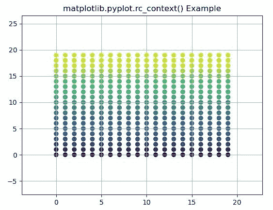
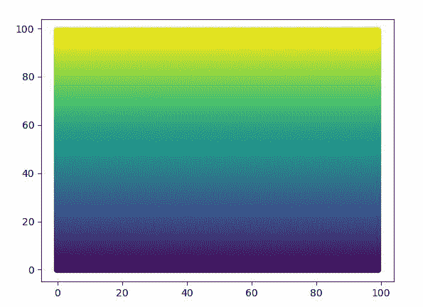
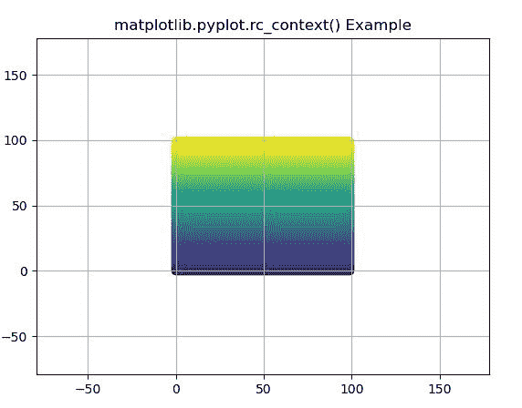

# matplotlib . pyplot . RC _ context()用 Python

表示

> 原文:[https://www . geeksforgeeks . org/matplotlib-pyplot-RC _ context-in-python/](https://www.geeksforgeeks.org/matplotlib-pyplot-rc_context-in-python/)

**[Matplotlib](https://www.geeksforgeeks.org/python-introduction-matplotlib/)** 是 Python 中的一个库，是 NumPy 库的数值-数学扩展。 **[Pyplot](https://www.geeksforgeeks.org/pyplot-in-matplotlib/)** 是一个基于状态的接口到 **Matplotlib** 模块，它提供了一个类似于 MATLAB 的接口。Pyplot 中可以使用的各种图有线图、等高线图、直方图、散点图、三维图等。

## matplotlib.pyplot.rc_context()函数

matplotlib 库 pyplot 模块中的 **rc_context()函数**用于返回管理 rc 设置的上下文管理器。

> **语法:**matplotlib . pyplot . RC _ context(RC = none，fname=None)
> 
> **参数:**
> 
> *   **rc:** 这个参数是字典也可以传递给上下文管理器。
> *   **fname:** 此参数包含要调用的文件名。
> 
> **返回:**该方法返回一个用于管理 rc 设置的上下文管理器。

下面的例子说明了 matplotlib.pyplot.rcdefaults()函数在 matplotlib.pyplot 中的作用:

**例 1:**

```py
# implementation of the matplotlib function
import matplotlib.pyplot as plt
import numpy as np

np.random.seed(19680801)

dots = np.arange(20)
x, y = np.meshgrid(dots, dots)
data = [x.ravel(), y.ravel()]

with plt.rc_context({'axes.xmargin': .2, 
                     'axes.ymargin': .4}):
    plt.scatter(*data, c = data[1])

plt.grid(True)

plt.title('matplotlib.pyplot.rc_context()\
Example')
plt.show()
```

**输出:**


**例 2:**

```py
# implementation of the matplotlib function
import matplotlib.pyplot as plt
import numpy as np

np.random.seed(19680801)

fig, ax = plt.subplots()
dots = np.arange(100)
x, y = np.meshgrid(dots, dots)

data = [x.ravel(), y.ravel()]
ax.scatter(*data, c = data[1])

with plt.rc_context({'axes.autolimit_mode': 'round_numbers',
                     'axes.xmargin': .8,
                     'axes.ymargin': .8}):

    fig, ax = plt.subplots()
    ax.scatter(*data, c = data[1])

plt.grid(True)

plt.title('matplotlib.pyplot.rc_context() Example')
plt.show()
```

**输出:**


