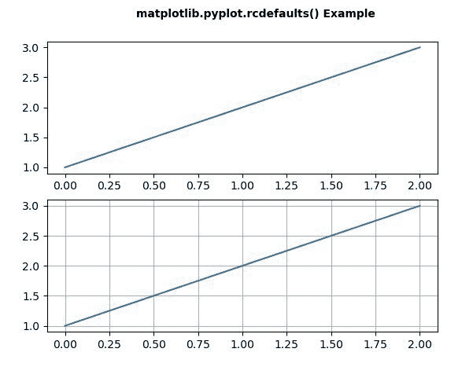
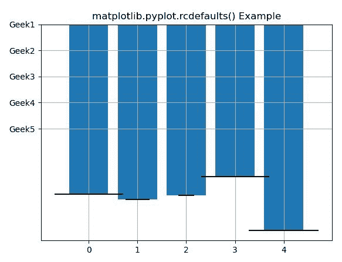

# matplotlib . pyplot . rcdefaults()用 Python

表示

> 哎哎哎:# t0]https://www . geeksforgeeks . org/matplot lib-pyplot-rcdefaults-in-python/

**[Matplotlib](https://www.geeksforgeeks.org/python-introduction-matplotlib/)** 是 Python 中的一个库，是 NumPy 库的数值-数学扩展。 **[Pyplot](https://www.geeksforgeeks.org/pyplot-in-matplotlib/)** 是一个基于状态的接口到 **Matplotlib** 模块，它提供了一个类似于 MATLAB 的接口。Pyplot 中可以使用的各种图有线图、等高线图、直方图、散点图、三维图等。

## matplotlib.pyplot.rcdefaults()函数

matplotlib 库 pyplot 模块中的 **rcdefaults()函数**用于从 Matplotlib 的内部默认样式中恢复 rc 参数。

> **语法:**matplotlib . pyplot . rcdefaults()
> 
> **参数:**该方法不接受任何参数。
> 
> **返回:**该方法不返回值。

下面的例子说明了 matplotlib.pyplot.rcdefaults()函数在 matplotlib.pyplot 中的作用:

**例 1:**

```
# implementation of the matplotlib function
import matplotlib.pyplot as plt

plt.subplot(211)
plt.rc('font', weight ='bold')
plt.rc('xtick.major', size = 5, pad = 7)
plt.rc('xtick', labelsize = 15)
plt.plot([1, 2, 3])

plt.text(0.4, 3.5, 'matplotlib.pyplot.rcdefaults() Example')

plt.rcdefaults()
plt.subplot(212)
plt.plot([1, 2, 3])
plt.grid(True)

plt.show()
```

**输出:**


**例 2:**

```
# implementation of the matplotlib function
import matplotlib.pyplot as plt
import numpy as np

np.random.seed(19680801)

plt.rcdefaults()
fig, ax = plt.subplots()

people = ('Geek1', 'Geek2', 'Geek3', 'Geek4', 'Geek5')
y_pos = np.arange(len(people))
performance = 3 + 5 * np.random.rand(len(people))
error = np.random.rand(len(people))

ax.bar(y_pos, performance, xerr = error, align ='center')
ax.set_yticks(y_pos)
ax.set_yticklabels(people)
ax.invert_yaxis()
plt.grid(True)

plt.title('matplotlib.pyplot.rcdefaults() Example')
plt.show()
```

**输出:**
