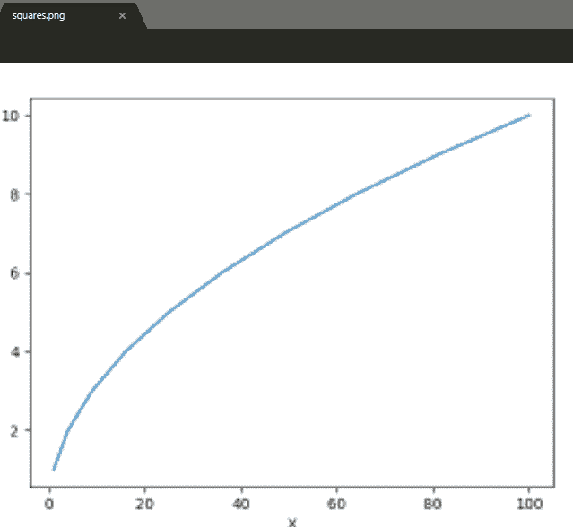

# matplotlib . pyplot . save config()用 Python

表示

> 哎哎哎:# t0]https://www . geeksforgeeks . org/matplot lib-pyplot-save config-in-python/

[Matplotlib](https://www.geeksforgeeks.org/graph-plotting-in-python-set-1/) 是 Python 中非常有用的可视化库。它是一个多平台数据可视化库，构建在 NumPy 阵列上，旨在与更广泛的 SciPy 堆栈一起工作。可视化发挥着非常重要的作用，因为它帮助我们理解大量数据并提取知识。

## Matplotlib.pyplot.savefig（）

顾名思义 savefig()方法用于保存[绘制](https://matplotlib.org/api/pyplot_summary.html)数据后创建的图形。使用这种方法可以将创建的图形保存到我们的本地机器上。

> **语法:** savefig(fname，dpi=None，facecolor='w '，edgecolor='w '，orientation= '纵向'，papertype=None，format=None，transparent=False，bbox_inches=None，pad_inches=0.1，frameon=None，metadata=None)

**参数:**

| 因素 | 描述 |
| --- | --- |
| fname | 文件名。图像的 png。pdf 格式的 pdf。
文件位置也可以在这里指定。 |
| （灰）点/英寸 （扫描仪的清晰度参数） | 每英寸点数。(图片质量) |
| 纸张类型 | 纸张类型可以是“a0 至 a10”、“行政”、“T0”、“b0 至 b10”、“信函”、“法律”、“分类账”。 |
| 格式 | 文件格式，如。png .，pdf。 |
| facecolor 和 edgecolor | 默认为白色。 |
| bbox _ 英寸 | 将它设置为“紧”以适合保存的图形。 |
| pad _ 英寸 | 在保存的图形周围填充。 |
| 透明的 | 使图片背景透明。 |
| 方向 | 风景或肖像。 |

**例 1:**

```
# importing required modules 
import matplotlib.pyplot as plt

# creating plotting data
xaxis =[1, 4, 9, 16, 25, 36, 49, 64, 81, 100]
yaxis =[1, 2, 3, 4, 5, 6, 7, 8, 9, 10]

# plotting 
plt.plot(xaxis, yaxis)
plt.xlabel("X")
plt.ylabel("Y")

# saving the file.Make sure you 
# use savefig() before show().
plt.savefig("squares.png")

plt.show()
```

**输出:**


**例 2:**

```
# importing the modules 
import matplotlib.pyplot as plt

# creating data and plotting a histogram
x =[1, 4, 9, 16, 25, 36, 49, 64, 81, 100]
plt.hist(x)

# saving the figure.
plt.savefig("squares1.png",
            bbox_inches ="tight",
            pad_inches = 1,
            transparent = True,
            facecolor ="g",
            edgecolor ='w',
            orientation ='landscape')

plt.show()
```

**输出:**
