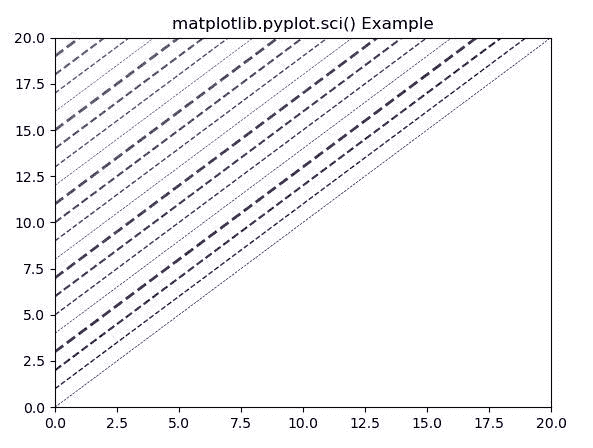
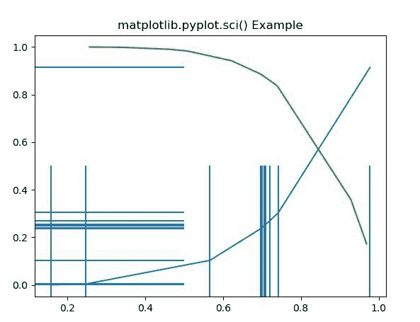

# Matplotlib.pyplot.sci()用 Python

表示

> 哎哎哎:# t0]https://www . geeksforgeeks . org/matplot lib-pyplot-sci-in-python/

**[Matplotlib](https://www.geeksforgeeks.org/python-introduction-matplotlib/)** 是 Python 中的一个库，是 NumPy 库的数值-数学扩展。 **[Pyplot](https://www.geeksforgeeks.org/pyplot-in-matplotlib/)** 是一个基于状态的接口到 **Matplotlib** 模块，它提供了一个类似于 MATLAB 的接口。Pyplot 中可以使用的各种图有线图、等高线图、直方图、散点图、三维图等。

## matplotlib.pyplot.sci()函数

matplotlib 库 pyplot 模块中的 **sci()函数**用于设置当前图像。

> **语法:** matplotlib.pyplot.sci(im)
> 
> **参数:**
> 
> *   **im:** 该图像将成为色彩映射功能的目标。
> 
> **返回:**该方法不返回值。

下面的例子说明了 matplotlib.pyplot.sci()函数在 matplotlib.pyplot 中的作用:

**例 1:**

```py
import matplotlib.pyplot as plt
from matplotlib.collections import LineCollection
from matplotlib import colors as mcolors

import numpy as np

N = 50
x = np.arange(N)

ys = [x + i for i in x]

fig, ax = plt.subplots()
ax.set_xlim(0, 20)
ax.set_ylim(0, 20)

line_segments = LineCollection([np.column_stack([x, y]) for y in ys],
                               linewidths =(0.5, 1, 1.5, 2),
                               linestyles ='dashed', color ="#eeffdd")

line_segments.set_array(1/(x + 1))
ax.add_collection(line_segments)
line_segments.set_array(x)

plt.sci(line_segments)  
plt.title('matplotlib.pyplot.sci() Example')

plt.show()
```

**输出:**


**例 2:**

```py
import matplotlib.pyplot as plt
from matplotlib.collections import EventCollection
from matplotlib.collections import LineCollection
import numpy as np

np.random.seed(19680801)
xvalue = np.random.random([2, 10])
xvalue1 = xvalue[0, :]
xvalue2 = xvalue[1, :]
xvalue1.sort()
xvalue2.sort()

yvalue1 = xvalue1 ** 4
yvalue2 = 1 - xvalue2 ** 6

fig = plt.figure()
ax = fig.add_subplot(1, 1, 1)
ax.plot(xvalue1, yvalue1, color ='tab:blue')
ax.plot(xvalue2, yvalue2, color ='tab:green')

xresult1 = EventCollection(xvalue1, color ='tab:blue')
yresult1 = EventCollection(yvalue1, color ='tab:blue',
                           orientation ='vertical')
ax.add_collection(xresult1)
ax.add_collection(yresult1)

plt.sci(xresult1)  
plt.title('matplotlib.pyplot.sci() Example')

plt.show()
```

**输出:**
