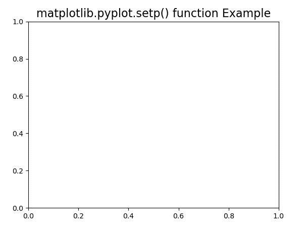
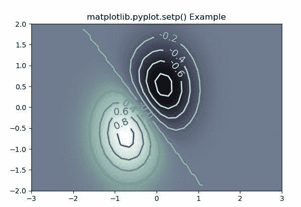

# Python 中的 Matplotlib.pyplot.setp()函数

> 原文:[https://www . geesforgeks . org/matplotlib-pyplot-set p-function-in-python/](https://www.geeksforgeeks.org/matplotlib-pyplot-setp-function-in-python/)

[**Matplotlib**](https://www.geeksforgeeks.org/python-introduction-matplotlib/) 是 Python 中的一个库，是 NumPy 库的数值-数学扩展。 [**Pyplot**](https://www.geeksforgeeks.org/pyplot-in-matplotlib/) 是一个基于状态的接口到 **Matplotlib** 模块，它提供了一个类似于 MATLAB 的接口。Pyplot 中可以使用的各种图有线图、等高线图、直方图、散点图、三维图等。

## Matplotlib.pyplot.setp（）

matplotlib 库 pyplot 模块中的**set()函数**用于设置艺术家对象的属性。

> **语法:** matplotlib.pyplot.setp(obj、\*args、\*\*kwargs)
> 
> **参数:**该方法接受以下描述的参数:
> 
> *   **obj:** 这个参数是艺术家对象。
> *   ****kwargs:** 接受不同的关键字参数。
> 
> **返回:**此方法不返回任何值。

下面的例子说明了 matplotlib.pyplot.setp()函数在 matplotlib.pyplot:

**例 1:**

## 蟒蛇 3

```
#Implementation of matplotlib function
import numpy as np
import matplotlib.pyplot as plt

def tellme(s):
    plt.title(s, fontsize=16)
    plt.draw()
plt.clf()
plt.setp(plt.gca(), autoscale_on=False)

tellme('matplotlib.pyplot.setp() function Example')
plt.show()
```

**输出:**



**例 2:**

## 蟒蛇 3

```
# Implementation of matplotlib function
import matplotlib
import numpy as np
import matplotlib.cm as cm
import matplotlib.pyplot as plt

delta = 0.25
x = np.arange(-3.0, 5.0, delta)
y = np.arange(-1.3, 2.5, delta)
X, Y = np.meshgrid(x, y)
Z = (np.exp(-X**2 - Y**2) - np.exp(-(X - 1)**2 - (Y - 1)**2))

im = plt.imshow(Z, interpolation='bilinear', 
                origin='lower',
                cmap="bone",
                extent=(-3, 3, -2, 2))

levels = np.arange(-1.2, 1.6, 0.2)
CS = plt.contour(Z, levels,
                 origin='lower', 
                 cmap='Greens',
                 linewidths=2,
                 extent=(-3, 3, -2, 2))

zc = CS.collections[6]
plt.setp(zc, linewidth=2)  
plt.clabel(CS, levels,
           inline=1,
           fmt='%1.1f',
           fontsize=14)

plt.title('matplotlib.pyplot.setp() Example')

plt.show()
```

**输出:**

