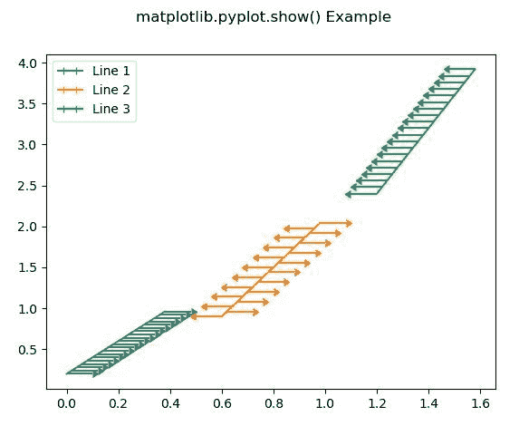
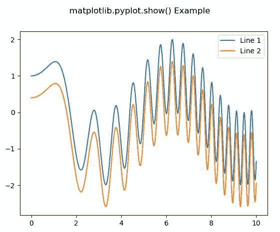

# Matplotlib.pyplot.show()用 Python

表示

> 哎哎哎:# t0]https://www . geeksforgeeks . org/matplot lib-pyplot-show in python/

**[Matplotlib](https://www.geeksforgeeks.org/python-introduction-matplotlib/)** 是 Python 中的一个库，是 NumPy 库的数值-数学扩展。 **[Pyplot](https://www.geeksforgeeks.org/pyplot-in-matplotlib/)** 是一个基于状态的接口到 **Matplotlib** 模块，它提供了一个类似于 MATLAB 的接口。

**样本代码–**

```py
# sample code
import matplotlib.pyplot as plt 

plt.plot([1, 2, 3, 4], [16, 4, 1, 8]) 
plt.show() 
```

**输出:**


## matplotlib.pyplot.show()函数

matplotlib 库 pyplot 模块中的 **show()功能**用于显示所有图形。

> **语法:**
> 
> ```py
> matplotlib.pyplot.show(*args, **kw)
> 
> ```
> 
> **参数:**该方法只接受一个参数，讨论如下:
> 
> *   **阻塞:**该参数用于覆盖上述阻塞行为。
> 
> **返回:**该方法不返回值。

下面的例子说明了 matplotlib.pyplot.show()函数在 matplotlib.pyplot 中的作用:

**示例#1:**

```py
# Implementation of matplotlib function
import matplotlib.pyplot as plt
import numpy as np

fig = plt.figure()
x = np.arange(20) / 50
y = (x + 0.1)*2

val1 = [True, False] * 10
val2 = [False, True] * 10

plt.errorbar(x, y, 
             xerr = 0.1, 
             xlolims = True, 
             label ='Line 1')

y = (x + 0.3)*3

plt.errorbar(x + 0.6, y, 
             xerr = 0.1,
             xuplims = val1,
             xlolims = val2,
             label ='Line 2')

y = (x + 0.6)*4
plt.errorbar(x + 1.2, y,
             xerr = 0.1, 
             xuplims = True,
             label ='Line 3')

plt.legend()

fig.suptitle('matplotlib.pyplot.show() Example')
plt.show()
```

**输出:**


**例 2:**

```py
# Implementation of matplotlib function
import numpy as np
import matplotlib.pyplot as plt

x = np.linspace(0, 10, 500)
y = np.sin(x**2)+np.cos(x)

fig, ax = plt.subplots()

ax.plot(x, y, label ='Line 1')

ax.plot(x, y - 0.6, label ='Line 2')

ax.legend()

fig.suptitle('matplotlib.pyplot.show() Example')
plt.show()
```

**输出:**
