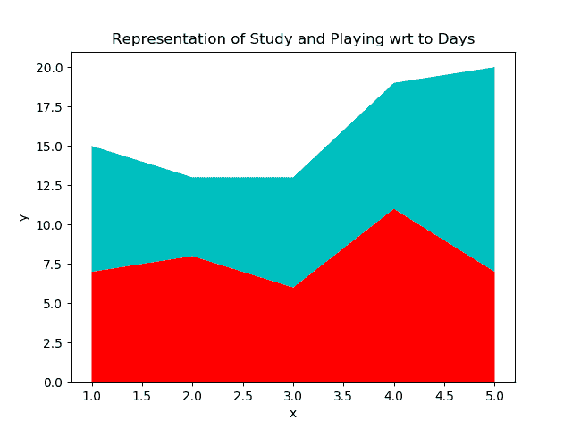

# Matplotlib.pyplot.stackplot()用 Python

表示

> 哎哎哎:# t0]https://www . geeksforgeeks . org/matplot lib-pyplot-stack plot-in-python/

**Matplotlib** 是 Python 中提供的可视化库。 **Pyplot** 包含各种帮助 matplotlib 像 MATLAB 一样工作的功能。它用作 matplotlib.pyplot，用于绘制图形、创建区域、线条等。

## Stackplot

pyplot 提供的众多功能中，有一个是 stackplot，这将在本文中讨论。堆叠图用于绘制堆叠面积图。它显示完整的可视化数据。它显示了堆叠在一起的每个零件，以及每个零件如何构成完整的图形。它显示数据的各种组成部分，其行为类似于饼图。它有 x 标签、y 标签和标题，其中不同的部分可以用不同的颜色来表示。

堆叠图的想法是随着时间的推移显示“整体的一部分”。它用于表示各种数据集，而不会相互重叠。

<figure class="table">

| 参数 | 价值 | 使用 |
| --- | --- | --- |
| x | 一维阵列 | 它是一维数组，用 N 维来给 X 轴赋值 |
| y | 二维阵列 | 表示未堆叠的二维 M*N 维数组。 |
| 颜色；色彩；色调 | 包含颜色列表或元组 | 它用于给定颜色范围来表示数据，默认值为无。 |
| 基线 | {“零”、“符号”、“摆动”、“加权摆动”} | 零表示基线不变。
围绕零值对称的符号。
摆动它将最小化平方和的值。
 |
| **克瓦格斯 | 其他关键字列表 | 其他参数或关键字。
 |

</figure>

**语法:**

> matplotlib.pyplot.stackplot(x，*args，标签=()，颜色=无，基线= '零'，数据=无，**kwargs)

**示例#1** :使用 stack lot
代码将 x 轴描述为周一到周五的天数，Y 轴用学习天数表示，播放时间分别用红色和青色表示。

## 蟒蛇 3

```py
import matplotlib.pyplot as plt

# List of Days
days = [1, 2, 3, 4, 5]

# No of Study Hours
Studying = [7, 8, 6, 11, 7]

# No of Playing Hours
playing =  [8, 5, 7, 8, 13]

# Stackplot with X, Y, colors value
plt.stackplot(days, Studying, playing,
              colors =['r', 'c'])

# Days
plt.xlabel('Days')

# No of hours
plt.ylabel('No of Hours')

# Title of Graph
plt.title('Representation of Study and \
Playing wrt to Days')

# Displaying Graph
plt.show()
```

**输出:**



**示例#2** :使用堆叠批次

## 蟒蛇 3

```py
import matplotlib.pyplot as plt

# List of 7-days
days = [x for x in range(0, 7)]

# List of Suspected cases
Suspected = [12, 18, 35, 50, 72, 90, 100]

# List of Cured Cases
Cured = [4, 8, 15, 22, 41, 55, 62]

# List of Number of deaths
Deaths = [1, 3, 5, 7, 9, 11, 13]

# Plot x-labels, y-label and data
plt.plot([], [], color ='blue',
         label ='Suspected')
plt.plot([], [], color ='orange',
         label ='Cured')
plt.plot([], [], color ='brown',
         label ='Deaths')

# Implementing stackplot on data
plt.stackplot(days, Suspected, Cured,
              Deaths, baseline ='zero',
              colors =['blue', 'orange',
                       'brown'])

plt.legend()

plt.title('No of Cases')
plt.xlabel('Day of the week')
plt.ylabel('Overall cases')

plt.show()
```