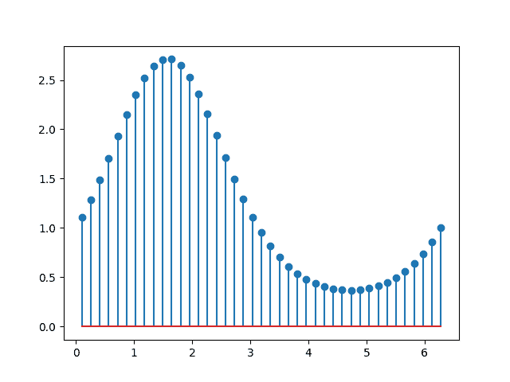
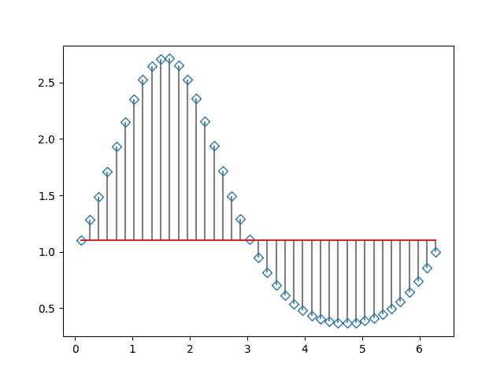

# Matplotlib.pyplot.stem()用 Python

表示

> 哎哎哎:# t0]https://www . geeksforgeeks . org/matplot lib-pyplot-system in python/

[Matplotlib](https://www.geeksforgeeks.org/graph-plotting-in-python-set-1/) 是 Python 中的可视化库，用于数组的 2D 图。Matplotlib 是一个多平台数据可视化库，构建在 NumPy 数组上，旨在与更广泛的 SciPy 堆栈一起工作。

## matplotlib.pyplot.stem()

**`matplotlib.pyplot.stem()`** 创造茎地块。A **`Stem plot`** 在从基线到 y 的图表下覆盖的每个 x 位置绘制垂直线，并在那里放置一个标记。

> **语法:**词干([x，] y，linefmt =无，markerfmt =无，basefmt =无)
> 
> **参数:**
> 
> *   **x(阵列状，可选):**茎的 x 位置。默认值:(0，1，…，len(y)–1)。
> *   **y(阵列状):**茎头的 y 值。
> *   **linefmt (str, optional):** A string defining the properties of the vertical lines. Usually, this will be a color or a color and a linestyle:
>     *   **'-':** 实线
>     *   **'–:**虚线
>     *   **'-':**点划线
>     *   **':'** 虚线
>     
>     **注意:**虽然在技术上可以指定除颜色或颜色和线型之外的有效格式(例如“rx”或“-.”)，这超出了方法的意图，很可能不会产生合理的情节。
>     
>     
> *   **标记物(str，可选):**定义茎头标记物特性的字符串。默认值:“C0o”，即以颜色循环的第一种颜色填充的圆圈。
> *   **basefmt (str，可选):**定义基线属性的格式字符串。
>     **默认:**“C3-”(“C2-”经典模式)。
> *   **底部(浮动，可选，默认:0):** 基线的 y 位置。
> *   **标签(str，可选，默认:无):**用于图例中茎的标签。
> *   **使用 _line_collection (bool，可选，默认值:False):** 如果为 True，则将茎线存储并绘制为 LineCollection，而不是单个线条。这显著提高了性能，并将成为 Matplotlib 3.3 中的默认选项。如果为假，则默认为使用线性 2D 对象列表的旧行为。
> 
> **返回**:
> 
> **container**: `StemContainer`
> 
> 容器可以被视为一个元组
> ( *标记线*、*茎线*、*基线*)

**示例#1:** 默认图

Stem 绘制从基线到 y 坐标的垂直线，并在尖端放置标记。

```py
# importing libraries
import matplotlib.pyplot as plt
import numpy as np

x = np.linspace(0.1, 2 * np.pi, 41)
y = np.exp(np.sin(x))

plt.stem(x, y, use_line_collection = True)
plt.show()
```

 **输出:**


**示例#2:**
基线的位置可以使用*底部*进行调整。参数 *linefmt、markerfmt* 和 *basefmt* 控制图的基本格式属性。然而，与`plot`相反，并非所有属性都可以通过关键字参数进行配置。对于更高级的控制，调整`pyplot`返回的线对象。

```py
# importing libraries
import random
import matplotlib.pyplot as plt

x = np.linspace(0.1, 2 * np.pi, 41)
y = np.exp(np.sin(x))

markerline, stemlines, baseline = plt.stem(
    x, y, linefmt ='grey', markerfmt ='D',
    bottom = 1.1, use_line_collection = True)

markerline.set_markerfacecolor('none')
plt.show()
```

**输出:**
